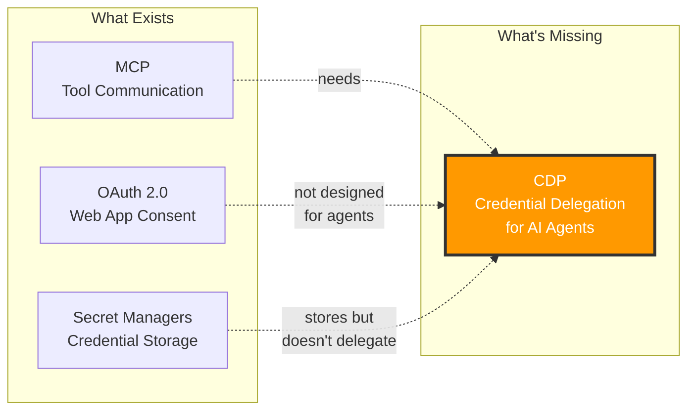
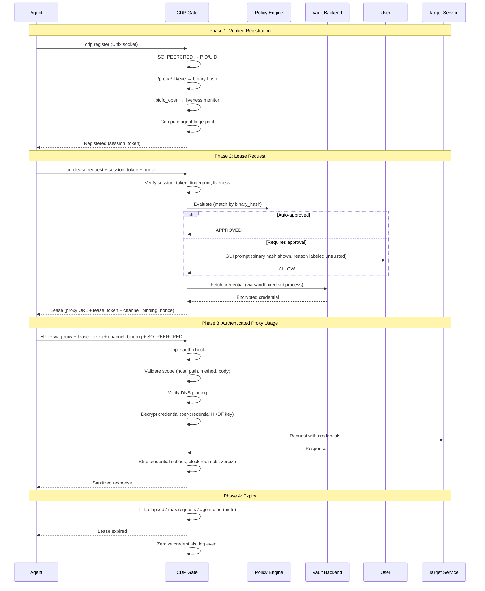
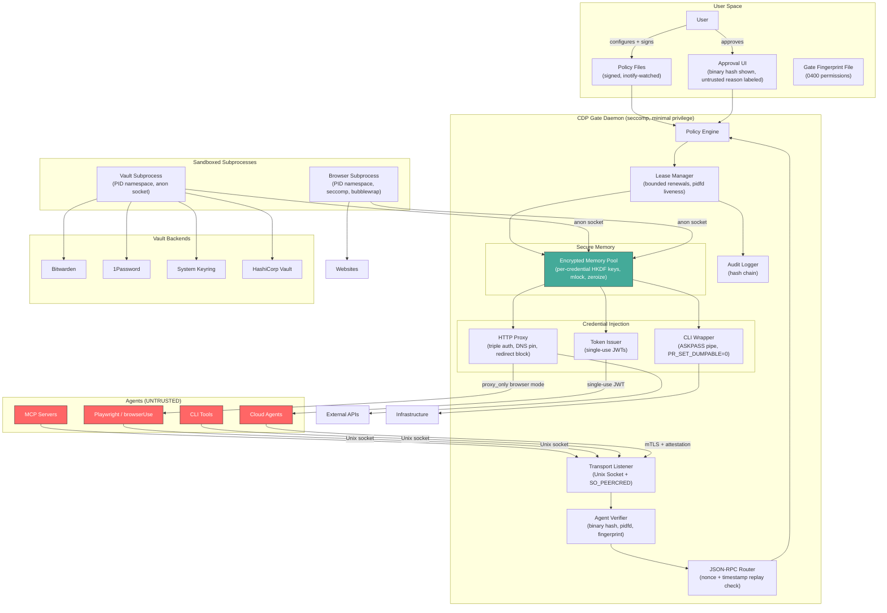
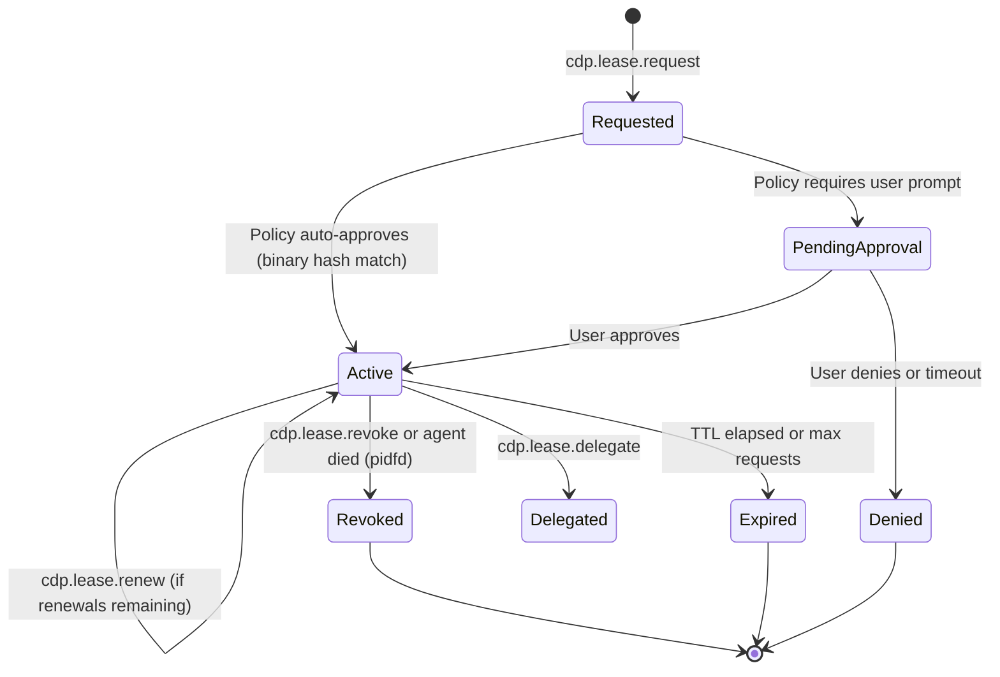
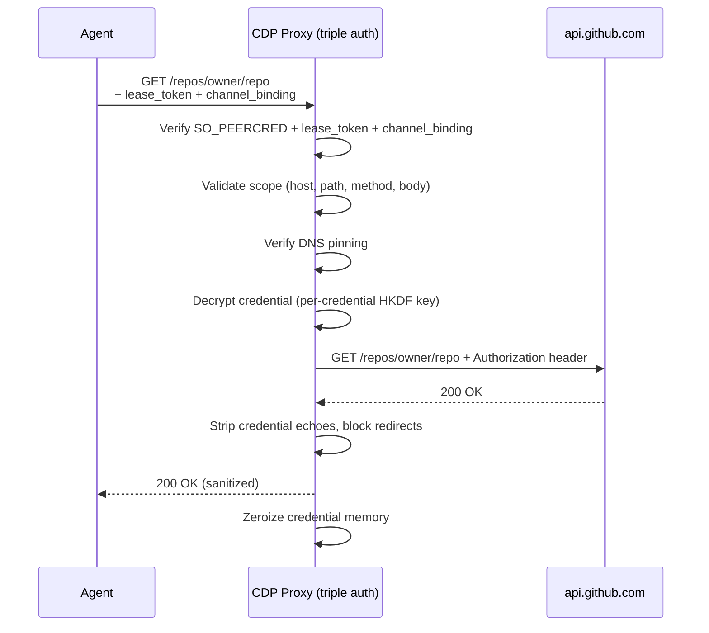
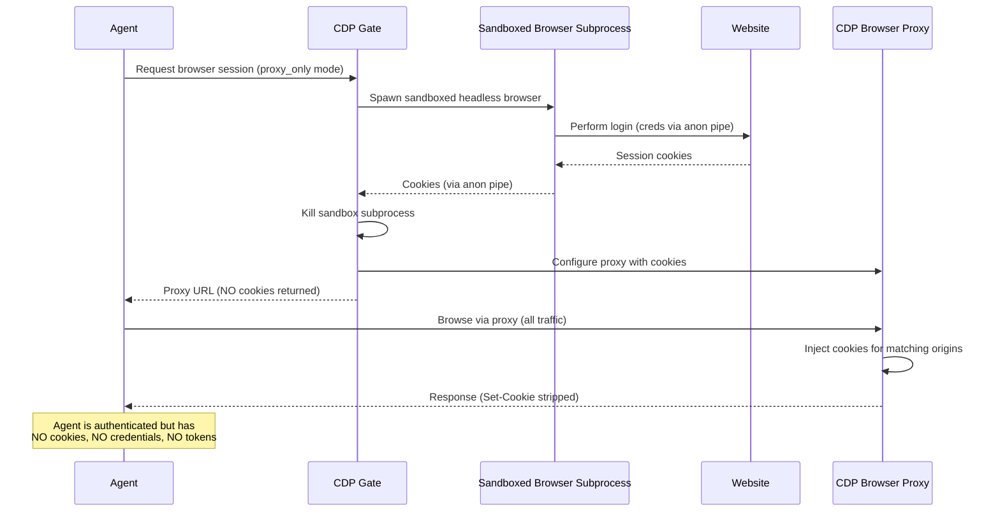
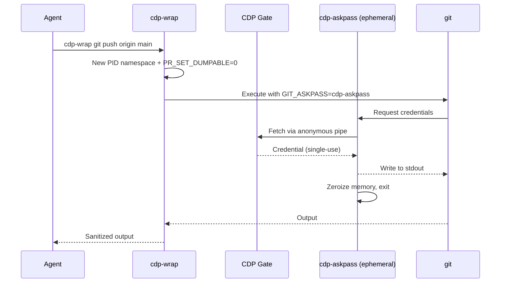
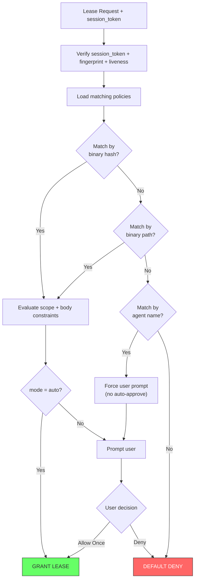
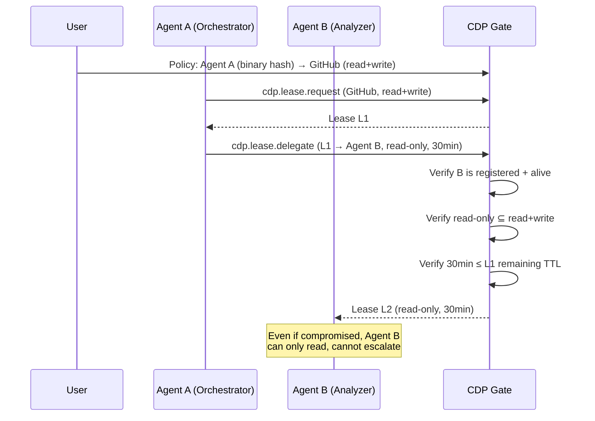
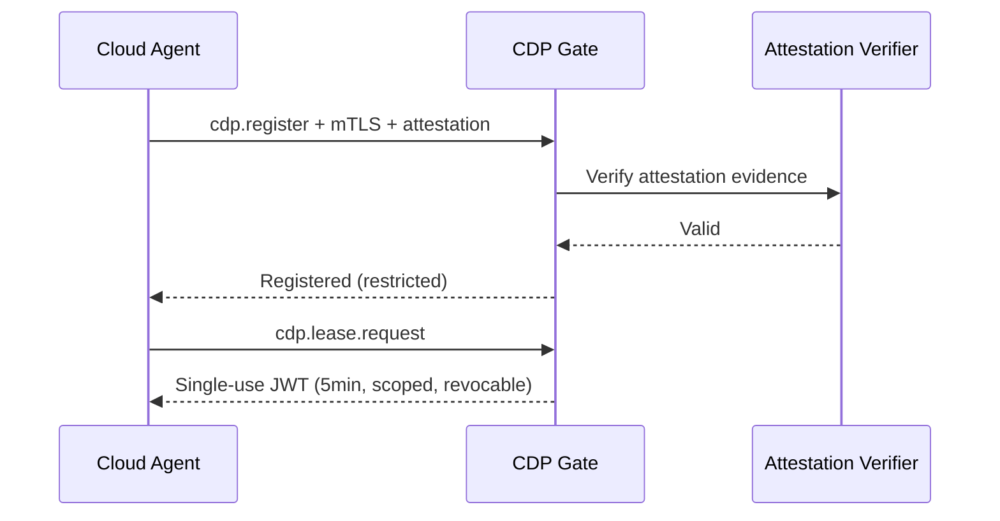

# CDP: Credential Delegation Protocol

### Secure Credential Access for AI Agents

**Version:** 0.2.0-draft
**Date:** April 2026
**Authors:** [TBD]

---

## Abstract

AI agents — MCP servers, browser automation tools, CLI wrappers, and cloud-hosted models — increasingly need to act on behalf of users. This requires credentials: API keys, session tokens, SSH keys, database passwords. Today, these credentials are handed to agents as plaintext strings, stored in environment variables, or pasted into conversation contexts. Every one of these approaches is fundamentally insecure.

The **Credential Delegation Protocol (CDP)** is an open protocol that enables AI agents to use credentials **without ever accessing them directly**. A local daemon called the **CDP Gate** mediates all credential access, injecting authentication material at the transport layer. Agents interact with authenticated services through an authenticated proxy — credentials never enter agent memory, context windows, logs, or outputs.

CDP is to credential access what MCP is to tool access: a standard protocol that the entire AI agent ecosystem can build on.

---

## Table of Contents

1. [The Problem](#1-the-problem)
2. [Design Principles](#2-design-principles)
3. [Protocol Overview](#3-protocol-overview)
4. [Architecture](#4-architecture)
5. [Core Protocol Flows](#5-core-protocol-flows)
6. [Credential Types & Injection Modes](#6-credential-types--injection-modes)
7. [Policy Engine](#7-policy-engine)
8. [Delegation Chains](#8-delegation-chains)
9. [AI-to-AI Credential Flow](#9-ai-to-ai-credential-flow)
10. [Security Architecture](#10-security-architecture)
11. [Reference Implementation](#11-reference-implementation)
12. [Comparison with Existing Solutions](#12-comparison-with-existing-solutions)
13. [Future Work](#13-future-work)

---

## 1. The Problem

The AI agent ecosystem is growing rapidly. MCP servers connect language models to tools. Browser automation frameworks like Playwright and browserUse let agents navigate the web. CLI wrappers let agents execute system commands. Cloud-hosted agents call APIs on behalf of users.

All of these need credentials. And all of them handle credentials badly.

### 1.1 Current Approaches and Their Failures

| Approach | How It Fails |
|----------|-------------|
| **Environment variables** | Visible in `/proc`, logged in crash dumps, captured by any library in the process |
| **Plaintext in prompts** | Stored in conversation history, potentially sent to third-party model providers |
| **`.env` files** | Accidentally committed to git, readable by any process under the user |
| **OAuth tokens to agents** | Over-scoped, long-lived, no audit trail, revocation requires manual intervention |
| **Secret manager CLIs** | The agent still receives the raw secret — it's just retrieved more securely |

### 1.2 Why This Is Getting Worse

Three trends are converging to make this critical:

1. **Prompt injection** — adversaries can take control of agent behavior through crafted inputs. A compromised agent with raw credentials is a complete account takeover.

2. **Multi-agent workflows** — orchestrator agents delegate to sub-agents, creating chains where credentials propagate through multiple untrusted components.

3. **MCP proliferation** — the Model Context Protocol makes it trivial to connect agents to new tools. Each MCP server is a new trust boundary that may need credentials, and the ecosystem has no standard for how to provide them safely.

### 1.3 The Missing Layer



OAuth solves user consent for web applications. Secret managers solve credential storage. **Nothing solves credential delegation for AI agents.** CDP fills this gap.

---

## 2. Design Principles

### 2.1 Zero-Knowledge Agents

Agents MUST NOT receive raw credentials at any point in the protocol. Credentials are injected at the transport layer by the CDP Gate — the agent sees authenticated responses but never the authentication material itself.

### 2.2 Assume Compromise

The protocol is designed under the assumption that any agent may be fully compromised — by prompt injection, malicious plugins, or supply chain attacks. Even a compromised agent cannot exfiltrate credentials because it never has them. Furthermore, the protocol assumes that other local processes (same UID) are also untrusted and may attempt to hijack proxy connections or read process memory.

### 2.3 Cryptographic Agent Identity

Agents are identified by the Gate through cryptographic fingerprinting — binary hash, process ID, and start time — not by self-declaration. An agent cannot claim to be something it isn't.

### 2.4 Scoped and Ephemeral

Every credential access is bound by:
- **Time** — leases expire automatically, with bounded renewals
- **Scope** — restricted to specific hosts, paths, methods, and request content
- **Rate** — limited number of requests per lease
- **Revocability** — any lease can be instantly revoked, cascading to delegated children

### 2.5 User-in-the-Loop

Users maintain control through a hybrid approval model:
- **Policy-based auto-approval** for known, trusted agent binaries (matched by hash)
- **Interactive GUI prompts** for unknown or sensitive requests, with untrusted-reason labeling
- **Default deny** for anything not covered by policy

### 2.6 Vault-Agnostic

CDP does not store credentials. It integrates with existing secret managers (Bitwarden, 1Password, system keyrings, HashiCorp Vault) through a pluggable backend interface, with vault sessions isolated in sandboxed subprocesses.

---

## 3. Protocol Overview

CDP is a JSON-RPC 2.0 protocol between agents and the CDP Gate daemon. Agents discover the Gate through a well-known Unix socket (`/run/cdp/gate.sock`) or a verified environment variable (`CDP_GATE_URL`).

### 3.1 Protocol Lifecycle



### 3.2 Key Insight

The agent never makes direct requests to the target service. All traffic flows through the CDP Gate proxy, which authenticates the agent, validates scope, injects credentials, pins DNS, and sanitizes responses. The proxy itself requires cryptographic proof of identity on every request.

---

## 4. Architecture

### 4.1 System Components



### 4.2 Verified Discovery

The Gate writes a fingerprint file on startup (`~/.config/cdp/gate.fingerprint`, permissions `0400`). SDKs verify this fingerprint before connecting — checking `SO_PEERCRED` against the Gate's PID for socket connections, or TLS certificate against the Gate's public key for HTTPS. This prevents rogue Gateimpersonation via `CDP_GATE_URL` poisoning.

### 4.3 Agent Registration

Every agent is cryptographically fingerprinted by the Gate:

1. `SO_PEERCRED` extracts PID/UID from the Unix socket connection
2. `/proc/<PID>/exe` resolves the agent's binary path
3. SHA-256 of the binary produces the agent's hash
4. `/proc/<PID>/stat` records the process start time
5. `pidfd_open()` establishes continuous liveness monitoring
6. Agent Fingerprint = `SHA-256(UID || PID || binary_hash || start_time)`

The agent receives a `session_token` (HMAC-bound to the fingerprint) required for all subsequent operations. Self-declared `agent_id` is used only for display — never for authorization.

---

## 5. Core Protocol Flows

### 5.1 Credential Lease

The central concept in CDP is the **credential lease** — a time-bound, scope-limited authorization for an agent to use a credential through the Gate proxy.

#### Request

```json
{
  "jsonrpc": "2.0",
  "method": "cdp.lease.request",
  "params": {
    "session_token": "cdp_sess_...",
    "nonce": "uuid-v4",
    "timestamp": "2026-04-07T14:00:00Z",
    "credential_ref": "github_api",
    "scope": {
      "hosts": ["api.github.com"],
      "methods": ["GET"],
      "paths": ["/repos/owner/repo/pulls"],
      "ttl_seconds": 600,
      "max_requests": 10
    },
    "reason": "Fetching open PRs for code review"
  },
  "id": 2
}
```

#### Response (Granted)

```json
{
  "jsonrpc": "2.0",
  "result": {
    "lease_id": "lease_a1b2c3d4",
    "status": "granted",
    "expires_at": "2026-04-07T15:10:00Z",
    "proxy": {
      "type": "http",
      "url": "http://127.0.0.1:19042/cdp/proxy",
      "lease_token": "cdp_lt_...",
      "channel_binding_nonce": "cb_nonce_..."
    },
    "constraints": {
      "max_requests": 10,
      "max_renewals": 3,
      "max_cumulative_ttl_seconds": 3600,
      "allowed_hosts": ["api.github.com"],
      "allowed_methods": ["GET"],
      "allowed_paths": ["/repos/owner/repo/pulls"]
    }
  },
  "id": 2
}
```

Every proxy request requires:
- `X-CDP-Lease-Token` — HMAC bearer token bound to agent fingerprint
- `X-CDP-Channel-Binding` — nonce linking control channel to data channel
- `SO_PEERCRED` — process identity matching the lease owner

### 5.2 Lease State Machine



---

## 6. Credential Types & Injection Modes

### 6.1 HTTP Proxy (APIs and MCP Servers)

The Gate operates as an HTTP proxy that injects authentication headers. Each request is validated against lease scope (host, path, method, body constraints), DNS is pinned, and redirects are blocked by default.



### 6.2 Browser Session (Playwright, browserUse, Selenium)

CDP defaults to **proxy_only** mode for browser sessions — the most secure option. All browser traffic routes through the CDP MITM proxy. The proxy injects session cookies for matching origins. The agent's browser context contains **no cookies** — they exist only in the proxy.



For scenarios where proxy mode is impractical, `scoped_snapshot` provides short-TTL, domain-restricted cookies. Full cookie exposure requires explicit policy opt-in and user approval.

The headless browser runs in a **sandboxed subprocess** with PID namespace, seccomp filtering, and dropped capabilities — isolated from Gate memory and credentials.

### 6.3 CLI Wrapper (git, ssh, kubectl)

The Gate provides `cdp-wrap`, which executes CLI tools without exposing credentials. Credentials are never pre-loaded into environment variables — instead, a helper binary (`cdp-askpass`) fetches credentials on demand via an anonymous pipe from the Gate.



### 6.4 Token Issuance (AI-to-AI)

For remote agents, the Gate issues single-use, scoped JWTs with 1–5 minute TTLs. This is the one case where an agent receives a credential-like artifact — but it is extremely constrained.

---

## 7. Policy Engine

### 7.1 Overview

Policies are TOML files defining what agents can access. Auto-approve policies MUST match by `agent_binary_hash` — matching by self-declared name alone is insufficient for automatic approval.



### 7.2 Policy Example

```toml
[[policy]]
name = "github-readonly"
[policy.match]
agent_binary_hash = "sha256:abc123..."  # Required for auto-approve
credential_ref = "github_api"
[policy.allow]
hosts = ["api.github.com"]
methods = ["GET"]
paths = ["/repos/**", "/users/**"]
forbidden_paths = ["/repos/*/keys", "/repos/*/hooks"]
max_ttl_seconds = 3600
max_renewals = 3
[policy.allow.body_constraints]
forbidden_fields = ["admin", "deploy_key"]
[policy.allow.network]
follow_redirects = false
dns_resolution = "pinned"
[policy.approval]
mode = "auto"
```

### 7.3 Policy Integrity

Policy files are protected against tampering:
- File permissions `0600`, directory `0700`
- `inotify` monitoring detects unauthorized modifications
- Optional Ed25519 policy signing with tamper rejection
- Auto-approve requires binary hash — even a tampered policy matching `agent_id` alone cannot bypass user approval

### 7.4 Approval UI

The approval dialog is designed to resist social engineering:
- Agent-provided reason is labeled **"unverified"** with visual separation
- Binary path and hash are shown (not self-declared name)
- First-time agents are flagged prominently
- Default action is "Allow Once" (not open-ended)
- Reason truncated to 200 characters

---

## 8. Delegation Chains

### 8.1 Scoped Sub-Delegation

CDP supports delegation for multi-agent workflows. An orchestrator agent can grant a sub-agent a **strict subset** of its own access.



### 8.2 Rules

1. Delegated scope MUST be a strict subset of the parent
2. Delegated TTL MUST NOT exceed the parent's remaining TTL
3. Maximum depth: configurable (default 3)
4. Parent revocation cascades to all children
5. Delegate target must be registered and alive
6. Policy can require user approval for delegation

---

## 9. AI-to-AI Credential Flow

Remote agents connect via mTLS with mandatory attestation (OIDC, enclave, or signed code). They receive single-use JWTs with 1–5 minute TTLs, stricter rate limits, and no delegation by default.



---

## 10. Security Architecture

CDP is designed to defend against 21 identified attack vectors across four categories: agent compromise, local process attacks, network attacks, and infrastructure attacks.

### 10.1 Agent Identity & Authentication

| Property | Mechanism |
|----------|-----------|
| Agent identity is cryptographic, not self-declared | Binary hash fingerprint via `SO_PEERCRED` + `/proc/<PID>/exe` |
| Proxy requires triple authentication | Lease token (HMAC) + channel binding nonce + `SO_PEERCRED` on every request |
| PID recycling is impossible | `pidfd_open()` + process start time in fingerprint |
| Auto-approve requires binary hash | Self-declared `agent_id` alone cannot match auto-approve policies |

### 10.2 Credential Protection

| Property | Mechanism |
|----------|-----------|
| Agents never see raw credentials | Proxy injection at transport layer |
| Browser sessions are zero-knowledge by default | `proxy_only` mode — cookies exist only in proxy |
| Credentials are encrypted with unique keys | HKDF per-credential key derivation from master session key |
| Credentials exist in plaintext for microseconds | Decrypt → inject → zeroize (mlock'd memory, core dumps disabled) |
| CLI credentials never in environment | On-demand fetch via anonymous pipe, `PR_SET_DUMPABLE=0` |

### 10.3 Network & Proxy Security

| Property | Mechanism |
|----------|-----------|
| No redirect-based credential leakage | Proxy does not follow redirects by default |
| No DNS rebinding attacks | DNS pinned at lease creation, verified on every request |
| Request body scope enforcement | Forbidden fields, forbidden paths, content type restrictions |
| Response sanitization | Credential-echoing headers stripped, Set-Cookie stripped |
| WebSocket lifecycle enforcement | Message counting, TTL-based connection kill, revocation kill |

### 10.4 Infrastructure Security

| Property | Mechanism |
|----------|-----------|
| Gate discovery cannot be poisoned | Fingerprint file verification before connection |
| Policy files resist tampering | inotify monitoring, optional Ed25519 signing, binary hash required for auto-approve |
| Browser exploits cannot reach Gate | Headless browser in sandboxed subprocess (PID ns, seccomp, dropped caps) |
| Vault sessions are isolated | Dedicated subprocess, anonymous socket communication, `PR_SET_DUMPABLE=0` |
| Audit logs are tamper-evident | Hash chain with integrity verification on startup |
| Lease renewal is bounded | Max renewals (3) and max cumulative TTL (4h) |
| Approval UI resists social engineering | Untrusted reason labeling, binary hash shown, first-time agent flagging |

### 10.5 What CDP Does NOT Protect Against

- **Gate daemon compromise** — if an attacker gets code execution in the Gate, credentials are accessible. Encrypted memory and per-credential keys reduce the blast radius. Future TEE support addresses this.
- **Vault backend compromise** — CDP relies on the vault's own security model.
- **User approving a malicious request** — the user is the ultimate authority. The approval UI provides context to inform decisions.
- **Supply chain attacks on agent binaries** — binary hash matches the compromised binary. Future: signed binary verification.

---

## 11. Reference Implementation

### 11.1 Technology Choice

The reference implementation is written in **Rust** for:
- Memory safety without garbage collection
- Fine-grained control over credential memory (mlock, zeroize, HKDF)
- Kernel integration (pidfd, seccomp, namespaces)
- Strong cryptographic libraries (ring, rustls, chacha20poly1305)

### 11.2 Crate Structure

```
cdp/
├── crates/
│   ├── cdp-gate/        # Main daemon binary
│   ├── cdp-policy/      # Policy engine (signing, matching, watching)
│   ├── cdp-lease/       # Lease lifecycle (bounded, liveness-monitored)
│   ├── cdp-crypto/      # Encrypted memory (per-credential HKDF keys)
│   ├── cdp-proxy/       # HTTP proxy (triple auth, DNS pin, redirect block)
│   ├── cdp-browser/     # Browser session manager (sandboxed subprocess)
│   ├── cdp-cli-wrap/    # CLI wrapper (ASKPASS pipe, PID namespace)
│   ├── cdp-vault/       # Vault backends (isolated subprocess)
│   ├── cdp-token/       # JWT issuance (single-use, Ed25519)
│   ├── cdp-audit/       # Audit logging (hash chain)
│   └── cdp-sdk/         # Client SDK (fingerprint verify, auto-inject headers)
```

### 11.3 Client SDKs

**TypeScript:**
```typescript
import { CdpClient } from '@cdp-protocol/sdk';

const cdp = new CdpClient(); // verifies gate fingerprint
const lease = await cdp.requestLease({
  credentialRef: 'github_api',
  scope: { hosts: ['api.github.com'], methods: ['GET'] },
  reason: 'Fetching repository data',
});

// SDK auto-includes lease_token + channel_binding headers
const res = await lease.fetch('/repos/owner/repo');
```

**Python:**
```python
from cdp_sdk import CdpClient

cdp = CdpClient()  # verifies gate fingerprint
lease = cdp.request_lease(
    credential_ref="github_api",
    scope={"hosts": ["api.github.com"], "methods": ["GET"]},
    reason="Fetching repository data",
)

# SDK auto-includes lease_token + channel_binding headers
response = lease.fetch("/repos/owner/repo")
```

---

## 12. Comparison with Existing Solutions

| | **CDP** | **OAuth 2.0** | **1Password Connect** | **SPIFFE/SPIRE** | **Vault Agent** |
|---|---|---|---|---|---|
| Designed for AI agents | Yes | No | No | No | No |
| Agent never sees credential | Yes | No | No | Yes (workload identity) | No |
| Cryptographic agent identity | Yes (binary hash) | N/A | N/A | Yes (SVID) | No |
| Proxy with triple auth | Yes | No | No | No | No |
| Scoped per-request validation | Yes | No (per-token) | No | No | No |
| DNS pinning | Yes | No | No | No | No |
| Redirect blocking | Yes | No | No | No | No |
| Request body constraints | Yes | No | No | No | No |
| User approval flow | Yes | Yes (web) | No | No | No |
| Delegation chains | Yes | Limited | No | No | No |
| Browser session support | Yes (proxy_only) | No | No | No | No |
| CLI wrapping | Yes (pipe-based) | No | No | No | No |
| Prompt injection resistant | Yes | N/A | N/A | N/A | N/A |
| Tamper-evident audit log | Yes | No | No | No | Yes |
| Open protocol + spec | Yes | Yes | No | Yes | No |

---

## 13. Future Work

### 13.1 Near Term
- Formal protocol spec (RFC-style) after community feedback
- Reference implementation MVP (HTTP proxy + Bitwarden backend)
- TypeScript and Python client SDKs
- Integration guides for popular MCP servers

### 13.2 Medium Term
- Browser session manager with full 2FA support
- CLI wrapper for common tools (git, ssh, kubectl, aws)
- 1Password and system keyring backends
- Audit log viewer / dashboard
- Signed binary verification for agent identity

### 13.3 Long Term
- TEE/enclave support for Gate daemon (hardware credential isolation)
- HSM/PKCS#11 for credential encryption keys
- IETF RFC standardization
- Integration with cloud provider IAM (AWS, GCP, Azure)
- Formal security verification of protocol properties

---

## Appendix A: Protocol Messages Reference

| Method | Direction | Description |
|--------|-----------|-------------|
| `cdp.register` | Agent → Gate | Register (Gate fingerprints agent) |
| `cdp.lease.request` | Agent → Gate | Request a credential lease |
| `cdp.lease.renew` | Agent → Gate | Extend lease (bounded) |
| `cdp.lease.revoke` | Agent/User → Gate | Revoke a lease |
| `cdp.lease.delegate` | Agent → Gate | Delegate subset to another agent |
| `cdp.lease.status` | Agent → Gate | Check lease status and quota |
| `cdp.credentials.list` | Agent → Gate | List policy-visible references only |
| `cdp.notify.expired` | Gate → Agent | Lease expired notification |
| `cdp.notify.revoked` | Gate → Agent | Lease revoked notification |

## Appendix B: Error Codes

| Code | Name | Description |
|------|------|-------------|
| -32001 | `AGENT_NOT_REGISTERED` | Must register first |
| -32002 | `CREDENTIAL_NOT_FOUND` | Not in vault or not visible to agent |
| -32003 | `POLICY_DENIED` | Policy denies access |
| -32004 | `USER_DENIED` | User denied approval |
| -32005 | `LEASE_EXPIRED` | TTL elapsed |
| -32006 | `LEASE_REVOKED` | Lease revoked |
| -32007 | `SCOPE_EXCEEDED` | Requested scope exceeds policy |
| -32008 | `DELEGATION_TOO_DEEP` | Max depth exceeded |
| -32009 | `ATTESTATION_FAILED` | Remote attestation failed |
| -32010 | `RATE_LIMITED` | Rate limit exceeded |
| -32011 | `VAULT_UNAVAILABLE` | Vault backend unreachable |
| -32012 | `APPROVAL_TIMEOUT` | User did not respond |
| -32013 | `CHANNEL_BINDING_FAILED` | Auth token/nonce mismatch |
| -32014 | `FINGERPRINT_MISMATCH` | Agent fingerprint changed |
| -32015 | `POLICY_INTEGRITY_ERROR` | Policy file tampered |
| -32016 | `RENEWAL_LIMIT_EXCEEDED` | Max renewals or TTL exceeded |
| -32017 | `REDIRECT_BLOCKED` | Redirect to disallowed host |
| -32018 | `DNS_REBINDING_DETECTED` | DNS resolved to unexpected IP |
| -32019 | `AGENT_PROCESS_DEAD` | Agent process no longer running |
| -32020 | `REPLAY_DETECTED` | Duplicate nonce or stale timestamp |

---

*CDP is an open-source project. Contributions to the specification and reference implementation are welcome.*
