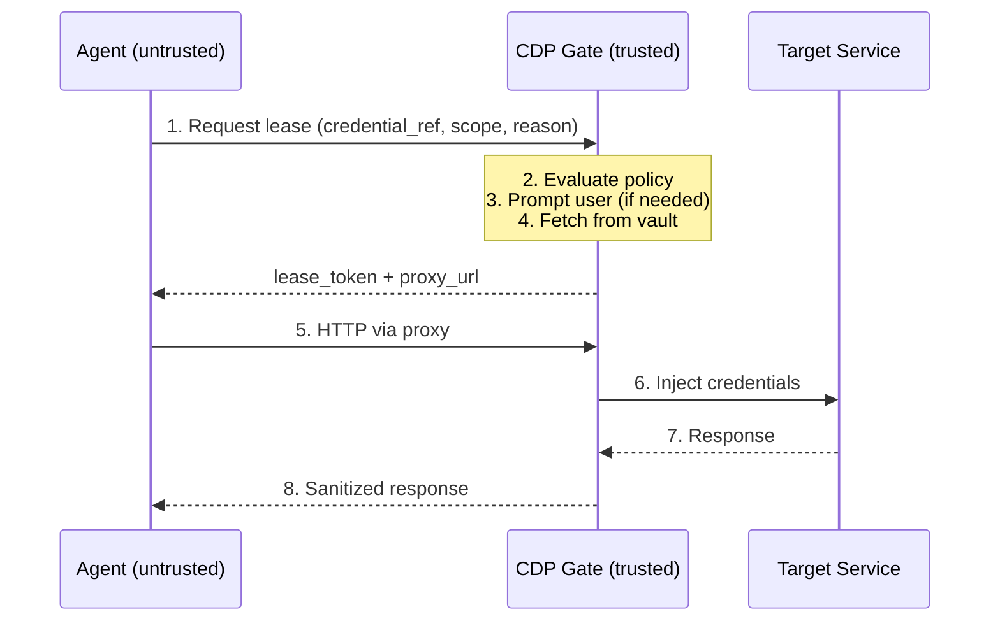

<p align="center">
  <h1 align="center">CDP — Credential Delegation Protocol</h1>
  <p align="center">
    An open protocol and reference implementation for <strong>secure credential delegation to AI agents</strong>.
    <br />
    Agents get authenticated access. They never see the credentials.
  </p>
  <p align="center">
    <a href="CDP_WHITEPAPER.md"><strong>Whitepaper</strong></a> &middot;
    <a href="spec/PROTOCOL.md"><strong>Protocol Spec</strong></a> &middot;
    <a href="spec/THREAT_MODEL.md"><strong>Threat Model</strong></a> &middot;
    <a href="spec/ARCHITECTURE.md"><strong>Architecture</strong></a> &middot;
    <a href="ROADMAP.md"><strong>Roadmap</strong></a>
  </p>
</p>

<br />

## The Problem

AI agents — MCP servers, browser automation, CLI tools, cloud-hosted models — increasingly need credentials to act on behalf of users. Every current approach is fundamentally broken:

| Approach | What Goes Wrong |
|----------|----------------|
| Plaintext env vars | Leak through logs, context windows, and prompt injection |
| Pasting tokens into prompts | Stored in conversation history, sent to remote models |
| OAuth tokens to agents | Over-scoped, long-lived, no revocation on compromise |
| Secret manager CLIs | Still expose raw secrets to agent memory |

**There is no standard protocol for delegating credentials to AI agents safely.**

CDP fills this gap — the same way [MCP](https://modelcontextprotocol.io/) standardized agent-tool communication, CDP standardizes agent-credential access.

## How It Works

A local daemon called the **CDP Gate** mediates all credential access. Agents never receive raw credentials — authentication is injected at the transport layer.



The agent communicates through an authenticated proxy. Credentials exist only inside the Gate's encrypted memory, decrypted at the moment of injection, then immediately zeroized.

## Design Principles

| Principle | What It Means |
|-----------|---------------|
| **Zero-knowledge agents** | Agents never see raw credentials at any point in the flow |
| **Assume compromise** | Designed so that even a prompt-injected agent cannot exfiltrate credentials |
| **Cryptographic identity** | Agent identity derived from `binary_hash + PID + UID` via `SO_PEERCRED`, not self-declared |
| **Scoped and ephemeral** | All access is time-limited, action-limited, and instantly revocable |
| **User-in-the-loop** | Policy-based auto-approval for trusted binaries, interactive GUI prompts for everything else |
| **Vault-agnostic** | Pluggable backends: Bitwarden, 1Password, system keyring, HashiCorp Vault |

## Credential Modes

CDP supports five credential injection modes, each designed for a different agent pattern:

| Mode | How It Works | Use Case |
|------|-------------|----------|
| **HTTP Proxy** | Gate injects auth headers into outbound requests | API keys, Bearer tokens, MCP servers |
| **Browser Session** | Gate logs in headlessly, injects cookies via proxy | Playwright, browserUse, Selenium |
| **MITM Proxy** | Gate terminates TLS, injects cookies, re-encrypts | WebSocket auth, streaming APIs |
| **CLI Wrapper** | Gate wraps CLI tools, injects creds via ASKPASS pipe | git, ssh, kubectl, aws-cli |
| **AI-to-AI Token** | Gate issues scoped single-use JWTs with attestation | Cloud-hosted agents, multi-agent chains |

## Security Model

CDP enforces these invariants at the protocol level:

- **Triple authentication on every proxy request** — lease token (HMAC) + channel binding nonce + `SO_PEERCRED`
- **Per-credential HKDF key isolation** — each credential encrypted with a unique derived key
- **DNS pinning at lease creation** — prevents DNS rebinding; no redirect following by default
- **Bounded renewals** — max 3 renewals, max 4h cumulative TTL per lease
- **Cascading revocation** — revoking a parent lease instantly revokes all delegated children
- **Pidfd liveness monitoring** — agent process death triggers automatic lease revocation
- **Sandboxed subprocesses** — vault and browser processes run in PID namespaces with seccomp-BPF
- **Tamper-evident audit logs** — hash-chained, verified on Gate startup
- **Credentials never in env vars** — CLI wrapper uses ASKPASS/pipe pattern with `PR_SET_DUMPABLE=0`

See the full [Threat Model](spec/THREAT_MODEL.md) covering 21 attack vectors with defenses using STRIDE methodology.

## Quick Start

### Prerequisites

- Rust 1.85+ (2024 edition)
- Linux (kernel 5.3+ for pidfd support)
- A vault backend (Bitwarden CLI, or use the built-in file-based dev vault)

### Build from Source

```bash
git clone https://github.com/user/cdp.git
cd cdp
cargo build --release
```

### Install

```bash
# Install binaries, config dirs, and systemd service
./install.sh

# Or without systemd:
./install.sh --no-systemd
```

This installs:
- `cdp-gate` and `cdp-wrap` to `~/.local/bin/`
- Config directory at `~/.config/cdp/` (0700)
- Data directory at `~/.local/share/cdp/` (0700)
- Example policy at `~/.config/cdp/policies/example.toml`
- Systemd user service (optional)

### Start the Gate

```bash
# Via systemd (recommended):
systemctl --user start cdp-gate

# Or directly:
cdp-gate
```

### Docker

```bash
docker build -t cdp-gate .
docker run -v /run/cdp:/run/cdp -v ~/.config/cdp:/etc/cdp:ro -p 9443:9443 cdp-gate
```

## Configuration

### Gate Config

`~/.config/cdp/gate.toml`:

```toml
[vault]
backend = "bitwarden"   # "bitwarden", "file", "1password", "system-keyring"

[audit]
path = "~/.local/share/cdp/audit.jsonl"

[gate]
socket_path = "/run/cdp/gate.sock"
approval_timeout_seconds = 300
```

### Policy Example

`~/.config/cdp/policies/github.toml`:

```toml
[[policy]]
name = "github-readonly"

[policy.match]
agent_binary_hash = "sha256:a1b2c3d4..."   # Required for auto-approve
credential_ref = "github_api"

[policy.allow]
hosts = ["api.github.com"]
methods = ["GET"]
paths = ["/repos/**"]
ttl_seconds = 600
max_requests = 100

[policy.approval]
mode = "auto"   # Trusted binary — no dialog needed
```

Policies are hot-reloaded via `inotify` — no Gate restart required.

## Client SDKs

### Python

```python
from cdp_sdk import CdpClient

client = CdpClient.discover()
session = client.register(agent_id="my-agent", agent_version="1.0.0")

lease = session.request_lease(
    credential_ref="github_api",
    scope={
        "hosts": ["api.github.com"],
        "methods": ["GET"],
        "paths": ["/repos/**"],
        "ttl_seconds": 600,
    },
    reason="Listing open PRs for code review",
)

# All requests through the proxy are automatically authenticated
response = lease.proxy_fetch("https://api.github.com/repos/owner/repo/pulls")
```

### TypeScript

```typescript
import { CdpClient } from "@cdp-protocol/sdk";

const client = await CdpClient.discover();
const session = await client.register("my-agent", "1.0.0");

const lease = await session.requestLease({
  credentialRef: "github_api",
  scope: {
    hosts: ["api.github.com"],
    methods: ["GET"],
    paths: ["/repos/**"],
    ttlSeconds: 600,
  },
  reason: "Listing open PRs for code review",
});

const response = await lease.proxyFetch(
  "https://api.github.com/repos/owner/repo/pulls"
);
```

### Rust

```rust
use cdp_sdk::{CdpClient, Scope};

let client = CdpClient::discover().await?;
let session = client.register("my-agent", "1.0.0").await?;

let lease = session.request_lease(
    "github_api",
    Scope::builder()
        .hosts(["api.github.com"])
        .methods(["GET"])
        .paths(["/repos/**"])
        .ttl_seconds(600)
        .build(),
    "Listing open PRs for code review",
).await?;

let response = lease.proxy_request(
    "https://api.github.com/repos/owner/repo/pulls"
).await?;
```

### CLI Wrapper

```bash
# Wrap any CLI tool — credentials injected via ASKPASS, never in env vars
cdp-wrap git push origin main
cdp-wrap ssh user@server
cdp-wrap kubectl apply -f deploy.yaml
```

## Architecture

```
cdp/
├── crates/
│   ├── cdp-gate/          # Main daemon — transport, routing, agent verification
│   ├── cdp-crypto/        # mlock'd memory, HKDF, ChaCha20-Poly1305, HMAC
│   ├── cdp-policy/        # TOML policy engine with hot-reload
│   ├── cdp-lease/         # Lease lifecycle, delegation, DNS pinning
│   ├── cdp-proxy/         # HTTP proxy with triple auth + credential injection
│   ├── cdp-vault/         # Vault backends (Bitwarden, file-based, sandboxed)
│   ├── cdp-browser/       # Headless browser sessions in sandbox
│   ├── cdp-cli-wrap/      # CLI wrapper with ASKPASS pipe pattern
│   ├── cdp-token/         # Ed25519 JWT issuer for AI-to-AI delegation
│   ├── cdp-audit/         # Hash-chained tamper-evident audit log
│   ├── cdp-sdk/           # Rust client SDK
│   └── cdp-integration-tests/
├── sdk/
│   ├── typescript/        # @cdp-protocol/sdk npm package
│   └── python/            # cdp-sdk pip package
├── packaging/
│   └── systemd/           # cdp-gate.service unit file
├── spec/                  # Protocol specification, threat model, architecture
├── Dockerfile
└── install.sh
```

### Key Internal Design

- **Transport**: Unix domain socket with `SO_PEERCRED` for local agents; mTLS on port 9443 for remote agents
- **Agent identity**: `SHA-256(UID || PID || binary_hash || start_time)` — cryptographic, not self-declared
- **Encrypted memory**: All credentials held in `mlock`'d `SecureBuffer` with `Zeroize` on drop
- **Key isolation**: Per-credential encryption keys derived via HKDF — compromise of one credential cannot affect others
- **Replay protection**: Nonce + timestamp validation (30s window) with LRU nonce cache
- **Delegation chains**: `User -> Agent A -> Agent B` with scope reduction at each hop

## Testing

```bash
# Run all unit tests (461+ tests)
cargo test --workspace

# Run integration tests
cargo test -p cdp-integration-tests

# Run with verbose output
cargo test --workspace -- --nocapture
```

The test suite covers:
- Cryptographic roundtrips and edge cases
- Policy parsing, validation, and evaluation
- Lease lifecycle (create, renew, revoke, delegate, expire)
- Triple authentication verification
- Audit chain integrity and tamper detection
- DNS pinning and scope intersection
- Token issuance, verification, and revocation

## CI/CD

GitHub Actions runs on every push and PR:
- `cargo build` — full workspace compilation
- `cargo test` — all 461+ tests
- `cargo clippy` — lint checks
- `cargo fmt --check` — formatting
- `cargo audit` — dependency vulnerability scanning

## Documentation

| Document | Description |
|----------|-------------|
| [CDP Whitepaper](CDP_WHITEPAPER.md) | Full protocol overview, architecture, threat model, and design rationale |
| [Protocol Specification](spec/PROTOCOL.md) | JSON-RPC 2.0 message formats, flows, credential types, error codes |
| [Threat Model](spec/THREAT_MODEL.md) | 21 attack vectors with defenses, STRIDE methodology |
| [Architecture](spec/ARCHITECTURE.md) | Crate structure, component design, deployment models |
| [User Journey](spec/USER_JOURNEY.md) | End-to-end walkthrough of the user and agent experience |
| [Roadmap](ROADMAP.md) | 11-phase implementation plan with dependency graph |

## Contributing

Contributions are welcome. Please read the protocol specification before submitting changes — security invariants documented in [CLAUDE.md](CLAUDE.md) must hold in any modification.

When editing specs, keep all four documents consistent: a change in `PROTOCOL.md` likely requires updates to the whitepaper, architecture, and threat model.

## License

Licensed under [Apache 2.0](LICENSE).

## Community

- [Contributing Guide](CONTRIBUTING.md) — how to contribute, code standards, PR process
- [Security Policy](SECURITY.md) — vulnerability reporting and security design
- [Code of Conduct](CODE_OF_CONDUCT.md) — community standards
- [Changelog](CHANGELOG.md) — release history
