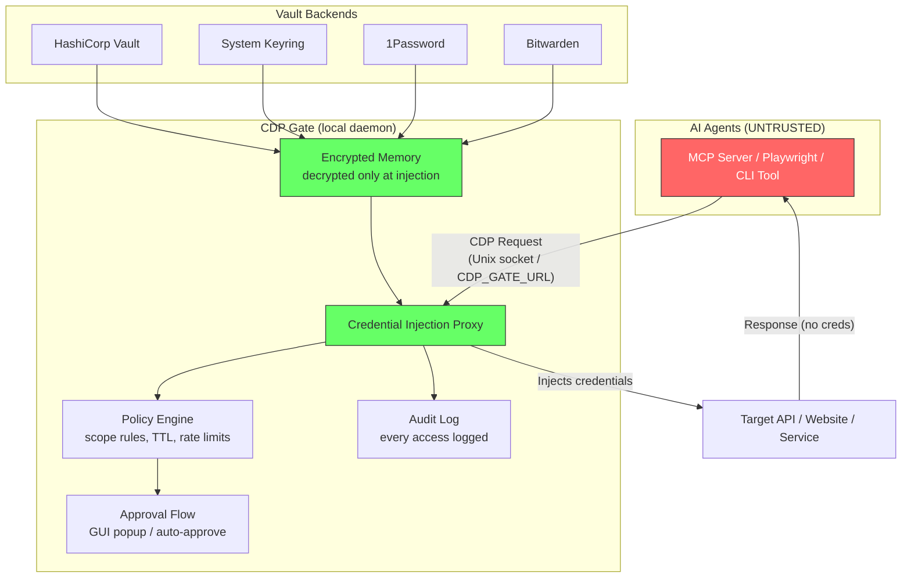

# CDP — Credential Delegation Protocol

A protocol and open-source reference implementation for **secure credential delegation to AI agents**.

## The Problem

AI agents (MCP servers, browser automation, CLI tools) need credentials to act on your behalf. Current approaches are fundamentally broken:

- Plaintext env vars leak through logs, context windows, and prompt injection
- Pasting tokens into prompts stores them in conversation history
- OAuth tokens handed to agents are over-scoped and long-lived
- Secret manager CLIs still expose raw secrets to agent memory

**There is no standard protocol for delegating credentials to AI agents safely.**

CDP fills this gap — the same way MCP standardized agent-tool communication, CDP standardizes agent-credential access.

## Design Principles

1. **Zero-knowledge agents** — agents never see raw credentials
2. **Assume compromise** — designed for prompt injection and rogue plugins
3. **Scoped and ephemeral** — time-limited, action-limited, revocable access
4. **User-in-the-loop** — policy-based auto-approve with interactive fallback
5. **Vault-agnostic** — plugs into Bitwarden, 1Password, system keyring, Vault, etc.

## Architecture Overview

## Credential Modes

| Mode | How It Works | Use Case |
|------|-------------|----------|
| **HTTP Proxy** | Gate injects auth headers into outbound requests | API keys, Bearer tokens, MCP servers |
| **Session Snapshot** | Gate logs in headlessly, injects cookies into agent browser | Playwright, browserUse, Selenium |
| **MITM Proxy** | Gate acts as HTTPS proxy for continuous auth injection | WebSocket auth, streaming APIs |
| **CLI Wrapper** | Gate wraps CLI tools, injects credentials via env/config | git, ssh, kubectl, aws-cli |
| **AI-to-AI** | Remote agents request scoped tokens with attestation | Cloud-hosted agents, multi-service chains |

## Documentation

- **[CDP Whitepaper](CDP_WHITEPAPER.md)** — full protocol overview, architecture, threat model, and design rationale
- [Protocol Specification](spec/PROTOCOL.md) — detailed message formats, flows, credential types
- [Threat Model](spec/THREAT_MODEL.md) — attack vectors and defenses
- [Architecture](spec/ARCHITECTURE.md) — reference implementation design

## Status

**Phase: Specification & Design** — We are defining the protocol before writing code. Contributions to the spec are welcome.

## Reference Implementation

The reference implementation will be written in **Rust** for memory safety, encrypted memory handling, and performance.

## License

Apache 2.0 + MIT dual license (TBD)
