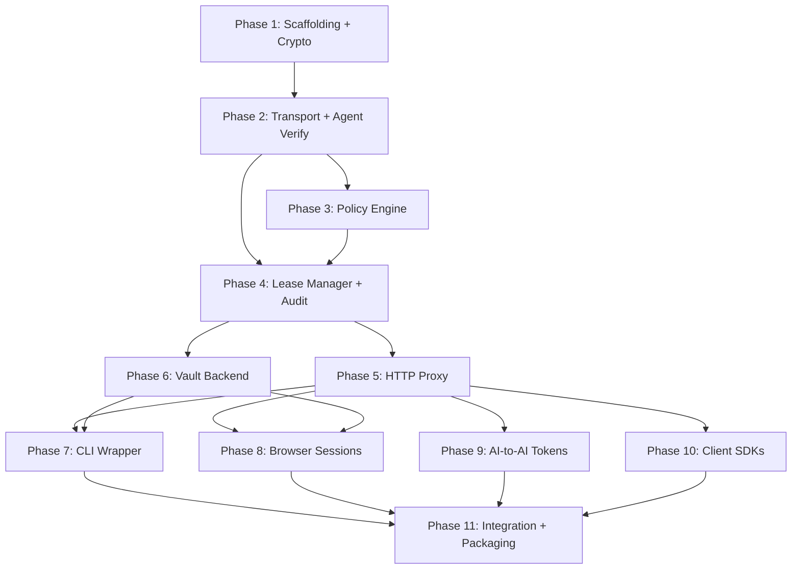

# CDP Implementation Roadmap

**Approach:** Phase-by-phase, each phase fully working before the next begins. Each phase produces testable, runnable artifacts. Context is provided per phase so an AI agent can implement it with minimal spec re-reading.

---

## Phase 1: Project Scaffolding & Core Crypto ✅

**Goal:** Cargo workspace with all crate stubs, CI pipeline, and the cryptographic primitives that every other component depends on.

**Context:** CDP is a Rust project using a workspace with 11 crates. The crypto crate is the foundation — it provides encrypted memory (mlock + zeroize), per-credential key derivation (HKDF-SHA256 from a master key), authenticated encryption (ChaCha20-Poly1305), and HMAC token generation. Every other crate depends on `cdp-crypto`. The master session key is derived via Argon2id from vault authentication. Each credential gets a unique encryption key via `HKDF-SHA256(master_key, credential_ref || lease_id)`. All credential memory must be mlock'd (prevent swap), and zeroized on drop (Rust `Drop` trait via `zeroize` crate). Core dumps must be disabled (`PR_SET_DUMPABLE=0`, `RLIMIT_CORE=0`).

**Tasks:**

1. **Create Cargo workspace** with root `Cargo.toml` and 11 empty crate stubs: `cdp-gate`, `cdp-policy`, `cdp-lease`, `cdp-crypto`, `cdp-proxy`, `cdp-browser`, `cdp-cli-wrap`, `cdp-vault`, `cdp-token`, `cdp-audit`, `cdp-sdk`. Each crate gets a `Cargo.toml` with placeholder dependencies and an empty `lib.rs` or `main.rs` (binaries: `cdp-gate`, `cdp-cli-wrap`). Add a workspace-level `rust-toolchain.toml` pinning to stable.

2. **Implement `cdp-crypto`** with these modules:
   - `mempool.rs` — `SecureBuffer<T>` struct that wraps a `Vec<u8>`, calls `mlock()` on allocation, implements `Drop` with `zeroize`. Provide `SecurePool` that stores `HashMap<String, EncryptedBlob>` where each blob is a credential encrypted at rest.
   - `hkdf.rs` — `derive_credential_key(master: &[u8], credential_ref: &str, lease_id: &str) -> [u8; 32]` using HKDF-SHA256. Key must be wrapped in a zeroizing type.
   - `cipher.rs` — `encrypt(key: &[u8; 32], plaintext: &[u8]) -> EncryptedBlob` and `decrypt(key: &[u8; 32], blob: &EncryptedBlob) -> SecureBuffer` using ChaCha20-Poly1305. Random 96-bit nonce per encryption.
   - `hmac.rs` — `generate_session_token(gate_key: &[u8], fingerprint: &[u8], connection_id: &[u8]) -> String` and `generate_lease_token(gate_key: &[u8], lease_id: &str, fingerprint: &[u8], cb_nonce: &[u8]) -> String` using HMAC-SHA256. Also `verify_token(...)` functions.
   - `zeroize.rs` — Re-export helpers and a `disable_core_dumps()` function that sets `PR_SET_DUMPABLE=0` and `RLIMIT_CORE=0`.
   - Dependencies: `chacha20poly1305`, `hkdf`, `sha2`, `hmac`, `zeroize` (with `derive` feature), `argon2`, `nix` (for mlock, prctl), `rand` (for nonces).
   - Write unit tests for every function: encrypt/decrypt roundtrip, HKDF determinism, HMAC verify, mlock success.

3. **Set up CI** — GitHub Actions workflow: `cargo build --workspace`, `cargo test --workspace`, `cargo clippy --workspace -- -D warnings`, `cargo fmt -- --check`. Runs on push and PR.

**Acceptance criteria:** `cargo build --workspace` succeeds. `cargo test -p cdp-crypto` passes all tests. CI green.

---

## Phase 2: Transport, Agent Verification & Registration ✅

**Goal:** The Gate daemon listens on a Unix socket, accepts agent connections, cryptographically fingerprints them, and issues session tokens. Agents can register and the Gate can detect when they die.

**Context:** The Gate listens on a Unix socket (default `/run/cdp/gate.sock`). When an agent connects, the Gate extracts PID/UID via `SO_PEERCRED` (the `nix` crate's `getsockopt` with `PeerCredentials`), reads `/proc/<PID>/exe` to resolve the binary path, computes SHA-256 of the binary, reads process start time from `/proc/<PID>/stat` (field 22), and opens a `pidfd` via `pidfd_open()` syscall for liveness monitoring. The agent fingerprint is `SHA-256(UID || PID || binary_hash || start_time)`. On registration, the Gate returns a session_token (HMAC from Phase 1). The Gate also writes a fingerprint file to `~/.config/cdp/gate.fingerprint` (permissions 0400) containing its own PID, binary hash, and Ed25519 public key. Communication uses JSON-RPC 2.0 with mandatory `nonce` (UUID v4) and `timestamp` fields for replay protection (reject timestamps >30s old, reject duplicate nonces via LRU set of 100k entries).

**Tasks:**

1. **Implement `cdp-gate` transport listener** (`listener.rs`):
   - Create Unix socket at configurable path, set permissions `0660`
   - Accept connections, extract `PeerCredentials` via `SO_PEERCRED`
   - Wrap each connection in a tokio task for concurrent handling
   - Dependencies: `tokio` (with `net`, `rt-multi-thread`, `macros`), `nix`

2. **Implement agent verification** (`agent_verify.rs`):
   - `verify_agent(pid: u32, uid: u32) -> Result<AgentFingerprint>` that:
     - Reads `/proc/<pid>/exe` symlink → binary path
     - Computes SHA-256 of the binary file
     - Reads `/proc/<pid>/stat` → extracts start time (field 22, space-delimited)
     - Calls `pidfd_open(pid, 0)` via raw syscall (libc or nix) → returns `OwnedFd`
     - Computes fingerprint: `SHA-256(uid_bytes || pid_bytes || binary_hash || start_time_bytes)`
   - `AgentFingerprint` struct: `uid`, `pid`, `binary_path`, `binary_hash`, `start_time`, `fingerprint_hash`, `pidfd: OwnedFd`
   - Liveness monitor: spawn a tokio task that polls the pidfd (epoll readable = process died). On death, send a message on a tokio channel.
   - Tests: verify fingerprint determinism, verify different PIDs produce different fingerprints.

3. **Implement Gate fingerprint file** (`fingerprint.rs`):
   - On startup: generate Ed25519 keypair, write JSON fingerprint to `~/.config/cdp/gate.fingerprint` with `0400` permissions
   - Contents: `gate_pid`, `gate_binary_hash`, `public_key` (base64 Ed25519), `socket_path`, `started_at`
   - On shutdown: delete the fingerprint file
   - Dependencies: `ed25519-dalek`

4. **Implement JSON-RPC router** (`router.rs`):
   - Parse JSON-RPC 2.0 messages from the socket connection
   - Validate `nonce` and `timestamp` on every request (LRU nonce set, 30s timestamp window)
   - Route `cdp.register` to registration handler
   - Registration handler: call `verify_agent()`, store in a `HashMap<Fingerprint, AgentRegistration>`, return `session_token`
   - Validate `session_token` on all non-register requests
   - Dependencies: `jsonrpsee` (or manual serde_json parsing — evaluate which is simpler for Unix socket), `uuid`, `chrono`, `lru`

5. **Implement Gate configuration** (`config.rs`):
   - Parse `~/.config/cdp/gate.toml` using `serde` + `toml`
   - All fields from the config spec in ARCHITECTURE.md Section 6
   - Default values for everything so the Gate can start with no config file
   - Expand `~` in paths

6. **Implement `cdp-gate` main entry point** (`main.rs`):
   - Load config, call `disable_core_dumps()`, write fingerprint file
   - Start Unix socket listener, start JSON-RPC router
   - Handle SIGTERM/SIGINT for graceful shutdown (delete fingerprint file, close socket)
   - Dependencies: `tokio`, `tracing`, `tracing-subscriber`

**Acceptance criteria:** Run `cdp-gate`, it creates the socket and fingerprint file. A test client connects, sends `cdp.register`, receives a session_token. Killing the test client triggers the pidfd liveness callback. Replayed nonces are rejected. Invalid timestamps are rejected.

---

## Phase 3: Policy Engine

**Goal:** The Gate can load, validate, and evaluate TOML policy files. Auto-approve requires `agent_binary_hash`. Policy directory is watched for changes.

**Context:** Policies live in `~/.config/cdp/policies/*.toml`. Each file contains one or more `[[policy]]` entries with `match`, `allow`, and `approval` sections. Matching priority: binary_hash > binary_path > agent_id. Auto-approve (`mode = "auto"`) is ONLY valid with `agent_binary_hash` or `agent_binary_path` in the match block — the parser must reject policies that use `mode = "auto"` with only `agent_id`. Scope evaluation: the lease scope is the intersection of what the agent requested and what the policy allows. The `allow` block includes `hosts`, `methods`, `paths`, `forbidden_paths`, `body_constraints` (forbidden_fields, max_size_bytes, allowed_content_types), and network settings (follow_redirects, dns_resolution). The user approval flow uses `kdialog`/`zenity`/`osascript` — the dialog must show binary path and hash, label the agent-provided reason as "unverified", default to "Allow Once", and truncate reason at 200 chars.

**Tasks:**

1. **Implement policy parser** (`parser.rs`):
   - Define Rust structs mirroring the TOML schema: `Policy`, `PolicyMatch`, `PolicyAllow`, `BodyConstraints`, `NetworkConstraints`, `PolicyApproval`, `PolicyDelegation`
   - Parse `~/.config/cdp/policies/*.toml`, collect all policies
   - Validation: reject `mode = "auto"` when `match` has only `agent_id` (no binary_hash or binary_path). Log a clear error.
   - Tests: valid policy parses correctly, auto-approve with only agent_id is rejected, missing fields use defaults.

2. **Implement policy evaluator** (`evaluator.rs`):
   - `evaluate(agent: &AgentFingerprint, credential_ref: &str, requested_scope: &Scope) -> PolicyDecision`
   - Match order: binary_hash exact → binary_path exact → agent_id wildcard → default deny
   - Scope intersection: compute `allowed_hosts ∩ requested_hosts`, same for methods, paths
   - `forbidden_paths` always wins over `paths` (deny-list overrides allow)
   - Return: `PolicyDecision::AutoApprove(granted_scope)`, `PolicyDecision::RequiresApproval(granted_scope)`, or `PolicyDecision::Denied(reason)`
   - Tests: exact match wins over wildcard, scope intersection works, forbidden_paths blocks, no-match returns deny.

3. **Implement policy watcher** (`watcher.rs`):
   - Use `inotify` crate to watch `~/.config/cdp/policies/` for `IN_MODIFY | IN_CREATE | IN_DELETE`
   - On change: re-read all policies, re-validate, log the PID of the process that made the change (read `/proc/self/fdinfo` on the inotify event, or check via `inotify` event metadata)
   - If the modifying process is not an interactive terminal/editor, log a security alert
   - Dependencies: `inotify`

4. **Implement approval flow** (`approval.rs`):
   - `prompt_user(agent: &AgentFingerprint, credential_ref: &str, scope: &Scope, reason: &str, config: &ApprovalConfig) -> Result<ApprovalResult>`
   - Launch `kdialog --warningyesno` (or `zenity --question`, or `osascript`) with formatted message
   - Message template shows: binary path, binary hash (truncated), credential ref, scope summary, duration, request count, and reason (labeled "Agent-provided, unverified", truncated to 200 chars)
   - Return: `AllowOnce`, `AllowTimed(duration)`, `Deny`
   - Timeout: configurable (default 30s), default-on-timeout is `Deny`
   - Tests: mock the subprocess call, verify formatting, verify timeout behavior.

5. **Optional: implement policy signing verifier** (`verifier.rs`):
   - If `policy_signing = true` in config, each `.toml` file must have a corresponding `.toml.sig` file containing an Ed25519 signature
   - Verify signature before loading. Reject tampered files.
   - Dependencies: `ed25519-dalek`

**Acceptance criteria:** Load example policies from `policies/` directory. Evaluate a mock agent against them — correct matching order, scope intersection, forbidden_paths denial. Auto-approve with only agent_id is rejected at parse time. File modification triggers reload. Approval dialog launches (manually tested).

---

## Phase 4: Lease Manager & Audit Logger

**Goal:** Complete lease lifecycle — create, renew (bounded), revoke, delegate, expire. Tamper-evident audit logging. Agent death triggers immediate revocation.

**Context:** Leases are in-memory only (never persisted to disk). Each lease has: `lease_id` (random 256-bit), `agent_fingerprint`, `credential_ref`, `scope`, `ttl`, `max_requests`, `requests_used`, `renewals_used`, `max_renewals` (default 3), `max_cumulative_ttl` (default 4h), `lease_token` (HMAC), `channel_binding_nonce` (random 256-bit), `dns_pinned_ips` (resolved at creation), `parent_lease_id` (for delegation), `child_lease_ids`. When the pidfd liveness monitor detects agent death, ALL leases for that agent must be immediately revoked, and credentials zeroized. Delegation: Agent A can create a child lease for Agent B if B is registered, the child scope is a strict subset of the parent, child TTL ≤ parent remaining TTL, and delegation depth ≤ max (default 3). Parent revocation cascades depth-first to all children. Audit log: each entry is a JSON line in `~/.local/share/cdp/audit.jsonl`. Each entry has a `sequence` number, `prev_hash` (SHA-256 of previous entry), and `hash` (SHA-256 of current entry). On Gate startup, verify the hash chain. Log permissions: `0600`.

**Tasks:**

1. **Implement lease manager** (`cdp-lease/manager.rs`):
   - `LeaseManager` struct holding `HashMap<LeaseId, Lease>` behind a `tokio::sync::RwLock`
   - `create_lease(agent: &AgentFingerprint, credential_ref: &str, scope: Scope, policy_constraints: &PolicyAllow) -> Result<Lease>` — generates lease_id, lease_token (via cdp-crypto HMAC), channel_binding_nonce, pins DNS (resolve hostnames → IPs via tokio's `lookup_host`), computes granted scope (intersection with policy), sets renewal counters
   - `renew_lease(lease_id, session_token, extend_seconds) -> Result<()>` — check renewals_used < max_renewals, check cumulative TTL won't exceed max, check agent alive, increment renewals_used
   - `revoke_lease(lease_id, reason) -> Result<()>` — cascade to children (depth-first), zeroize credentials, emit audit events
   - `use_lease(lease_id) -> Result<()>` — increment requests_used, check < max_requests, check not expired
   - Background task: sweep expired leases every 5 seconds (secondary to pidfd — pidfd is the primary death detector)

2. **Implement delegation** (`cdp-lease/delegation.rs`):
   - `delegate(parent_lease_id, delegate_to_agent, child_scope, child_ttl) -> Result<Lease>`
   - Verify: child_scope ⊂ parent_scope (strict subset: every host, path, method in child must be in parent)
   - Verify: child_ttl ≤ parent remaining TTL
   - Verify: delegation depth ≤ max (walk parent chain, count depth)
   - Verify: delegate_to_agent is registered and alive
   - Create child lease linked to parent via `parent_lease_id`
   - Add child ID to parent's `child_lease_ids`

3. **Implement liveness integration** (`cdp-lease/liveness.rs`):
   - Receive agent-death notifications from the pidfd monitor (tokio channel from Phase 2)
   - On death: find all leases for that agent fingerprint, revoke each (cascading), remove agent registration
   - Must be O(n) in number of leases for that agent, not O(n) in total leases

4. **Implement DNS pinning** (`cdp-lease/dns_pin.rs`):
   - `pin_dns(hosts: &[String]) -> Result<HashMap<String, Vec<IpAddr>>>` — resolve each host, store all IPs
   - `verify_dns(pinned: &HashMap<String, Vec<IpAddr>>, host: &str, resolved_ip: IpAddr) -> bool`
   - Use tokio's async DNS resolution

5. **Implement channel binding** (`cdp-lease/channel_bind.rs`):
   - `generate_nonce() -> [u8; 32]` using `rand::OsRng`
   - `verify_binding(expected: &[u8; 32], received: &[u8]) -> bool` using constant-time comparison

6. **Implement audit logger** (`cdp-audit/logger.rs`):
   - `AuditLogger` that appends JSON lines to the audit file
   - Each entry: `sequence`, `timestamp`, `event` (enum), `lease_id`, `agent_fingerprint`, `credential_ref`, `scope`, `policy_matched`, `approval_method`, `prev_hash`, `hash`
   - Hash chain: `hash = SHA-256(sequence || timestamp || event || ... || prev_hash)`
   - Events: all from the spec (agent.registered, agent.died, lease.requested/approved/denied/granted/used/renewed/revoked/expired/delegated, credential.rotated, security.alert, proxy.blocked)
   - File permissions: `0600`, created if missing

7. **Implement hash chain verifier** (`cdp-audit/integrity.rs`):
   - `verify_chain(path: &Path) -> Result<ChainStatus>` — read all entries, verify each hash links to previous
   - Called on Gate startup. Log SECURITY ALERT if chain is broken.

**Acceptance criteria:** Create a lease, verify it has DNS pins and tokens. Renew 3 times — 4th fails. Revoke a parent lease — children are revoked. Kill an agent process — its leases are revoked within milliseconds. Audit log has valid hash chain. Chain verification catches tampering.

---

## Phase 5: HTTP Proxy with Credential Injection

**Goal:** Working HTTP proxy that authenticates agents (triple auth), validates scope, injects credentials, pins DNS, blocks redirects, and sanitizes responses.

**Context:** Each active lease gets a proxy endpoint on `127.0.0.1` (port from configurable range 19000-19999). The agent makes HTTP requests to this proxy. Every request must include `X-CDP-Lease-Token` and `X-CDP-Channel-Binding` headers, and the proxy checks `SO_PEERCRED` on the TCP connection. Scope validation checks: host matches allowed_hosts, path matches allowed_paths (glob), method matches allowed_methods, path is NOT in forbidden_paths, request body (if POST/PUT/PATCH) is checked for forbidden_fields (JSON key presence), content-type matches allowed_content_types, body size ≤ max_size_bytes. DNS: resolve the target host and compare to pinned IPs. Redirects: if 3xx response, do NOT follow — return it to the agent with credential headers stripped. Credential injection: decrypt from encrypted memory pool (per-credential HKDF key), add as configured headers (e.g., `Authorization: Bearer <token>`), zeroize immediately after sending. Response sanitization: strip `Authorization`, `Set-Cookie`, and `WWW-Authenticate` headers from responses.

**Tasks:**

1. **Implement proxy authentication** (`cdp-proxy/auth.rs`):
   - `authenticate(conn: &TcpStream, lease_token: &str, cb_nonce: &str, lease_manager: &LeaseManager) -> Result<LeaseId>`
   - Extract `SO_PEERCRED` from the TCP connection
   - Verify `X-CDP-Lease-Token` via HMAC (from cdp-crypto)
   - Verify `X-CDP-Channel-Binding` via constant-time compare
   - Verify PID/UID matches lease owner
   - Return the lease_id if all pass, else 403

2. **Implement scope validator** (`cdp-proxy/scope.rs`):
   - `validate_request(request: &Request, lease: &Lease) -> Result<()>`
   - Host check: request Host header must be in `allowed_hosts`
   - Path check: request path must match at least one `allowed_paths` glob AND not match any `forbidden_paths` glob. Use `glob` or `globset` crate.
   - Method check: request method in `allowed_methods`
   - Body checks (for POST/PUT/PATCH): parse JSON body, check no key in `forbidden_fields` exists (recursive JSON key search), check Content-Type in `allowed_content_types`, check body size ≤ `max_size_bytes`
   - Dependencies: `globset`

3. **Implement DNS pin verifier** (`cdp-proxy/dns.rs`):
   - Before forwarding: resolve target host, compare to pinned IPs from lease
   - Mismatch → block request, log `proxy.blocked` audit event with `dns_rebinding_detected`

4. **Implement HTTP proxy core** (`cdp-proxy/http.rs`):
   - For each active lease, bind a `TcpListener` on `127.0.0.1:<port>` (allocate from port range)
   - On request: authenticate → validate scope → verify DNS pin → decrypt credential → build outbound request with injected headers → send → sanitize response → return to agent → zeroize credential → log `lease.used`
   - Use `hyper` as the HTTP server/client. Build the outbound request manually (do NOT use a high-level HTTP client that might follow redirects).
   - Dependencies: `hyper`, `http`, `hyper-util`, `tokio`

5. **Implement redirect handler** (`cdp-proxy/redirect.rs`):
   - If response status is 3xx: check `follow_redirects` policy flag
   - If false (default): return the response to agent as-is but strip any `Authorization` header that was echoed
   - If true: validate `Location` header host against `allowed_hosts`. If allowed, follow (re-inject credentials). If not allowed, block and return 403 with audit log.

6. **Implement response sanitizer** (`cdp-proxy/sanitizer.rs`):
   - Strip headers: `Authorization`, `Set-Cookie`, `WWW-Authenticate`, `Proxy-Authorization`
   - Optional: scan for patterns matching known credential formats (Bearer tokens, Basic auth, API key patterns) in other headers. Configurable via regex list.

7. **Integration: wire proxy into Gate** — when a lease is created in Phase 4, start a proxy listener. When a lease is revoked/expired, shut down the listener and close all connections.

**Acceptance criteria:** Agent registers, gets a lease, makes requests through the proxy — credentials are injected. Requests to wrong host/path/method → 403. Request with forbidden_fields in body → 403. DNS mismatch → blocked. Redirect to unknown host → blocked. Response has no Set-Cookie or Authorization headers. Invalid lease_token or channel_binding → 403. Wrong PID → 403.

---

## Phase 6: Vault Backend (Bitwarden + File-based Dev)

**Goal:** The Gate can fetch credentials from Bitwarden (via CLI in sandboxed subprocess) or from an encrypted JSON file (for development).

**Context:** Vault backends implement a `VaultBackend` trait with `list_credentials`, `fetch`, `exists`, and `watch_rotation` methods. The Bitwarden backend communicates with the `bw` CLI. Critically, the vault session (e.g., `BW_SESSION` token) must NEVER be in the Gate's main process. It must live only in a sandboxed subprocess that communicates with the Gate via an anonymous Unix socket pair (`socketpair()`). The subprocess runs in a separate PID namespace with a restricted seccomp profile and `PR_SET_DUMPABLE=0`. If the subprocess crashes, the user must re-authenticate. The file-based backend is for dev/testing only — an AES-encrypted JSON file with credential refs mapped to values.

**Tasks:**

1. **Define the VaultBackend trait** (`cdp-vault/lib.rs`):
   - `async fn list_credentials(&self) -> Result<Vec<CredentialRef>>`
   - `async fn fetch(&self, ref_id: &str) -> Result<EncryptedCredential>` (returns already-encrypted bytes)
   - `async fn exists(&self, ref_id: &str) -> Result<bool>`
   - `async fn watch_rotation(&self, ref_id: &str) -> Result<RotationStream>`
   - `CredentialRef` struct: `id`, `name`, `vault_type`
   - `EncryptedCredential`: opaque bytes (the vault subprocess encrypts with a shared key before sending over the socket)

2. **Implement vault subprocess manager** (`cdp-vault/subprocess.rs`):
   - Spawn a child process using `clone()` with `CLONE_NEWPID` (or `unshare` fallback)
   - Create `socketpair(AF_UNIX, SOCK_STREAM)` — parent gets one fd, child gets the other
   - Child sets `PR_SET_DUMPABLE=0`, applies seccomp filter (allow: read, write, open, close, mmap, mprotect, execve, exit_group, and a small whitelist for bw CLI operation)
   - Protocol over socket: simple length-prefixed JSON messages (`4-byte length || JSON payload`)
   - Commands: `list`, `fetch <ref_id>`, `exists <ref_id>`, `unlock <master_password>` (passed once at startup, user-prompted)
   - Responses: `ok <data>`, `error <message>`
   - On child crash: parent detects socket close, logs error, sets vault status to `locked`, requires re-auth

3. **Implement Bitwarden backend** (`cdp-vault/bitwarden.rs`):
   - Runs inside the vault subprocess
   - `bw unlock` — prompts user for master password (via Gate approval UI), receives session key
   - `bw list items --session <key>` — list credentials
   - `bw get item <id> --session <key>` — fetch credential
   - Session key held ONLY in subprocess memory
   - Parse `bw` JSON output with serde

4. **Implement file-based dev backend** (`cdp-vault/file.rs`):
   - Reads `~/.config/cdp/dev-vault.json.enc` — ChaCha20-Poly1305 encrypted JSON
   - Decrypted with a password derived via Argon2id
   - JSON format: `{"credentials": {"github_api": "ghp_xxx...", "slack_token": "xoxb-xxx..."}}`
   - For development and testing only — log a warning when this backend is active
   - Provide a CLI tool or function to create/update the encrypted file

5. **Integration: wire into Gate** — on startup, spawn vault subprocess based on config. On lease creation, call `vault.fetch(credential_ref)`, encrypt result with per-credential HKDF key, store in `SecurePool` from Phase 1.

**Acceptance criteria:** Gate starts with file-based backend, fetches a credential, stores it encrypted, proxy injects it into a request. Bitwarden backend unlocks, lists credentials, fetches one. Vault subprocess crash is detected, vault status becomes locked. Subprocess runs in separate PID namespace (verified via `/proc/<pid>/status` NSpid field).

---

## Phase 7: CLI Wrapper

**Goal:** `cdp-wrap` binary that executes CLI tools with credentials injected via the ASKPASS pipe pattern, without exposing credentials in environment variables or process listings.

**Context:** `cdp-wrap git push origin main` is the user-facing command. The wrapper: (1) connects to the Gate, registers, requests a CLI lease, (2) spawns the child process in a new PID namespace (if available) with `PR_SET_DUMPABLE=0`, (3) sets `GIT_ASKPASS=<path-to-cdp-askpass>` in the child's env (this is a path, NOT a credential), (4) when git calls `cdp-askpass` to get credentials, the askpass binary reads the credential from an anonymous pipe connected to the Gate, writes it to stdout (for git), zeroizes memory, and exits immediately, (5) the wrapper captures the child's output, scans for credential patterns, strips them, and returns sanitized output. For SSH: the Gate implements a minimal SSH agent protocol on a Unix socket, set `SSH_AUTH_SOCK` to that socket. For kubectl/aws/docker: use their native credential helper/process protocols.

**Tasks:**

1. **Implement `cdp-cli-wrap` main** (`main.rs`):
   - Parse args: `cdp-wrap <command> [args...]`
   - Connect to Gate (via cdp-sdk discovery), register, request CLI lease for the given command
   - Determine injection method based on command name (git → ASKPASS, ssh → SSH_AUTH_SOCK, kubectl → KUBECONFIG, aws → credential_process, generic → ASKPASS)
   - Create anonymous pipe pair for credential delivery

2. **Implement process namespace** (`namespace.rs`):
   - `spawn_isolated(command, args, env, pipe_fd) -> Result<Child>`
   - Try `clone(CLONE_NEWPID)` first, fallback to normal `fork`
   - Set `PR_SET_DUMPABLE=0` on child
   - Set up environment: add `GIT_ASKPASS=<askpass_path>` (or equivalent for other tools)
   - Inherit the anonymous pipe fd for credential delivery

3. **Implement cdp-askpass helper** (`askpass.rs`):
   - Minimal binary (or function called via a symlink trick)
   - On invocation: read credential from the pipe fd (passed via env var `CDP_PIPE_FD`), write to stdout, zeroize buffer, exit with 0
   - Must be as small as possible — entire lifecycle is: read pipe → write stdout → zeroize → exit
   - The pipe fd is inherited from the parent, not exposed in any discoverable way

4. **Implement output sanitizer** (`sanitize.rs`):
   - Read child's stdout/stderr through a pipe
   - Scan for patterns: Bearer tokens (`ghp_`, `gho_`, `xoxb-`, `sk-`, etc.), base64 strings that look like credentials, known credential env var patterns
   - Replace matches with `[CDP:REDACTED]`
   - Configurable pattern list via Gate policy or config

5. **Implement wrapper command execution** (`exec.rs`):
   - Tie together: create pipe → spawn child → wait for ASKPASS callback → deliver credential via pipe → wait for child exit → sanitize output → return exit code
   - Handle signals: forward SIGTERM/SIGINT to child
   - Clean up: ensure pipe is closed, askpass is dead, no lingering credential material

**Acceptance criteria:** `cdp-wrap git push origin main` successfully authenticates and pushes (with a dev vault credential). `ps aux` shows no credentials in process args. `/proc/<child_pid>/environ` is unreadable (PR_SET_DUMPABLE=0). Output containing a token pattern shows `[CDP:REDACTED]`. ASKPASS helper exits immediately after delivery.

---

## Phase 8: Browser Session Manager

**Goal:** The Gate can log into websites via a sandboxed headless browser and provide authenticated browser sessions to agents without exposing credentials.

**Context:** Default mode is `proxy_only` — the agent's browser routes ALL traffic through the CDP MITM proxy, which injects session cookies. The agent never receives cookies. Login flow: Gate spawns a headless Chromium in a sandboxed subprocess (Bubblewrap/PID namespace/seccomp), sends login credentials via anonymous socket pair, the subprocess performs the login, extracts cookies, returns them via the socket, and is immediately killed. The MITM proxy uses a short-lived (24h), name-constrained CA certificate. The CA key lives only in the MITM proxy subprocess memory, never the Gate main process or disk. For 2FA: the subprocess pauses, the Gate prompts the user (via the approval UI) for the 2FA code, passes it to the subprocess.

**Tasks:**

1. **Implement browser sandbox** (`cdp-browser/sandbox.rs`):
   - Spawn headless Chromium via `bubblewrap` (bwrap) with: new PID namespace, new network namespace (loopback only + proxy route), seccomp filter (block ptrace/process_vm_readv), dropped capabilities, read-only rootfs
   - Fallback to `unshare` if bwrap unavailable
   - Communication: anonymous Unix socket pair
   - The subprocess receives: login URL, credential (username/password), and proxy settings over the socket
   - The subprocess returns: extracted cookies as JSON
   - Subprocess is killed (`SIGKILL`) immediately after cookie extraction

2. **Implement session snapshot** (`cdp-browser/snapshot.rs`):
   - Inside the subprocess: use `headless_chrome` crate (or `chromiumoxide`) to:
     - Navigate to login URL
     - Fill in username/password fields (field selectors configurable per credential, or use common heuristics: `input[type=password]`, `input[name=username]`, etc.)
     - Submit form
     - Detect 2FA prompts (configurable selectors or URL pattern matching)
     - If 2FA: send request to Gate via socket, Gate prompts user, passes code back, subprocess enters code
     - Wait for successful login (configurable: URL change, cookie presence, selector appears)
     - Extract all cookies via Chrome DevTools Protocol
   - Return cookies as structured JSON over the socket

3. **Implement cookie filtering** (`cdp-browser/cookies.rs`):
   - Filter extracted cookies: only keep session-relevant cookies (not tracking/analytics)
   - Configurable: keep-list or drop-list of cookie name patterns
   - For `scoped_snapshot` mode: strip HttpOnly flag, restrict domain, set short Max-Age
   - For `proxy_only` mode: cookies are kept in the proxy, never returned to agent

4. **Implement MITM proxy CA** (`cdp-proxy/mitm_ca.rs`):
   - Generate a root CA keypair (Ed25519 or RSA-2048 for browser compat)
   - CA certificate: validity 24 hours, name-constrained to origins in active browser leases (X.509 Name Constraints extension)
   - Generate per-origin leaf certificates on-the-fly (signed by the CA)
   - CA key: encrypted in memory with per-lease HKDF key, decrypted only during signing
   - CA cert added to browser context only (Playwright's `--ignore-certificate-errors-spki-list` or custom CA injection)

5. **Implement MITM proxy mode** (`cdp-proxy/mitm.rs`):
   - HTTPS proxy that terminates TLS (using the per-origin leaf cert), injects cookies, and re-encrypts to the target
   - For matching origins: add session cookies from the cookie store
   - Strip `Set-Cookie` headers from responses before returning to agent
   - Non-matching origins: tunnel through without interception (CONNECT passthrough)
   - Dependencies: `rustls`, `rcgen` (for certificate generation)

6. **Integration with the lease flow** — when a `browser_session` lease is requested: spawn sandbox → login → extract cookies → configure MITM proxy → return proxy URL to agent. On lease expiry: clear cookies, stop proxy for that origin.

**Acceptance criteria:** Agent requests browser session for a test site. Gate logs in via sandboxed headless browser. In `proxy_only` mode: agent browses through proxy, is authenticated, has zero cookies in its browser context. MITM CA cert is name-constrained and short-lived. Sandbox subprocess is killed after snapshot. 2FA flow prompts user and completes login.

---

## Phase 9: AI-to-AI Token Issuer

**Goal:** Remote agents can connect via mTLS, prove identity via attestation, and receive single-use, scoped JWTs.

**Context:** Remote agents connect to the Gate's mTLS listener (port 9443 by default). They MUST present a client certificate. Attestation types: `mtls` (pre-shared client cert), `oidc` (OIDC identity token verified against trusted IdPs), `enclave` (TEE attestation — future), `signed_code` (signed binary hash — future). After registration, remote agents request leases and receive JWTs instead of proxy URLs. JWTs are: Ed25519 signed, single-use by default (contain a `jti` nonce), 1-5 minute TTL, scoped to audience + actions. The Gate publishes a revocation list at a well-known endpoint. Remote agents have stricter constraints: shorter TTL, lower rate limits, no delegation by default.

**Tasks:**

1. **Implement mTLS listener** (extend `cdp-gate/listener.rs`):
   - Add a TLS listener on configurable port (default 9443) using `rustls` with client certificate requirement
   - Client CA cert configured in `gate.toml`
   - Extract client certificate identity (CN or SAN) for agent registration

2. **Implement attestation verifier** (`cdp-token/validator.rs` or new module):
   - `verify_attestation(attestation_type: &str, evidence: &[u8]) -> Result<AttestationResult>`
   - `mtls`: verify client cert against trusted CA (already done by TLS layer)
   - `oidc`: verify JWT token from trusted IdP (Google, GitHub, etc.) — check `iss`, `aud`, `exp`, signature against IdP's JWKS
   - `enclave` and `signed_code`: stub implementations for future
   - Dependencies: `jsonwebtoken` (for OIDC JWT verification)

3. **Implement JWT issuer** (`cdp-token/issuer.rs`):
   - Ed25519 signing key: generated on Gate startup, held in mlock'd memory
   - `issue_token(lease: &Lease, audience: &str, scopes: &[String]) -> String`
   - JWT claims: `iss` (Gate identity), `sub` (agent identity), `aud` (target audience), `exp`, `iat`, `jti` (unique nonce for single-use), `scope`, `lease_id`, `delegation_chain`
   - Sign with Ed25519
   - Dependencies: `ed25519-dalek`, `base64`, `serde_json`

4. **Implement revocation list** (`cdp-token/revocation.rs`):
   - In-memory list of revoked `jti` values
   - Expose via a simple HTTP endpoint on the Gate (or as a JSON-RPC method)
   - The list is signed so target APIs can verify its authenticity
   - Entries expire (no need to keep revoked nonces past their original TTL)

5. **Implement remote lease constraints** — when the agent is remote (detected by connection type):
   - Override max TTL to `remote_max_ttl_seconds` (default 300)
   - Set `single_use = true` by default
   - Disable delegation unless explicitly policy-allowed
   - Return JWT instead of proxy URL in lease response

**Acceptance criteria:** Remote agent connects via mTLS, presents OIDC attestation, registers successfully. Requests a lease, receives a single-use JWT. JWT verifies with the Gate's public key. Second use of same JWT is rejected. Revocation list contains revoked JTI values.

---

## Phase 10: Client SDKs

**Goal:** TypeScript and Python SDKs that handle discovery, fingerprint verification, registration, lease management, and auto-injection of proxy auth headers.

**Context:** SDKs must: (1) discover the Gate via fingerprint file then Unix socket or `CDP_GATE_URL`, (2) verify the Gate fingerprint (SO_PEERCRED for socket, TLS cert for HTTPS), (3) register and store the session_token, (4) request leases and manage renewal, (5) provide a `fetch()`-like API that auto-injects `X-CDP-Lease-Token` and `X-CDP-Channel-Binding` headers on proxy requests. For TypeScript: target Node.js, publish as `@cdp-protocol/sdk`. For Python: target 3.10+, publish as `cdp-sdk`. Also implement the Rust SDK crate `cdp-sdk` in the workspace.

**Tasks:**

1. **Implement Rust SDK** (`cdp-sdk`):
   - `CdpClient::discover() -> Result<CdpClient>` — read fingerprint file, connect to socket, verify
   - `client.register() -> Result<Session>` — send `cdp.register`, receive session_token
   - `session.request_lease(params) -> Result<Lease>`
   - `lease.fetch(path) -> Result<Response>` — make HTTP request through proxy with auth headers auto-injected
   - `lease.renew()`, `lease.revoke()`
   - Handle reconnection if socket drops

2. **Implement TypeScript SDK** (`sdk/typescript/`):
   - Use `node:net` for Unix socket, `node:fs` for fingerprint file
   - JSON-RPC client over the socket
   - `CdpClient` class with `discover()`, `register()`, `requestLease()`, `requestBrowserSession()`
   - `Lease` class with `fetch(path, options)` that wraps `node:fetch` with proxy + headers
   - Package as npm package `@cdp-protocol/sdk`
   - Include TypeScript types for all protocol messages

3. **Implement Python SDK** (`sdk/python/`):
   - Use `socket` module for Unix socket
   - JSON-RPC client over socket
   - `CdpClient` class with `discover()`, `register()`, `request_lease()`
   - `Lease` class with `fetch(path)` wrapping `httpx` or `requests` with proxy + headers
   - Package as pip package `cdp-sdk`
   - Include type hints (py.typed)

**Acceptance criteria:** Each SDK can: discover Gate, verify fingerprint, register, request lease, make authenticated proxy request, renew, revoke. TypeScript example from the whitepaper works. Python example from the whitepaper works.

---

## Phase 11: Integration Testing & Packaging

**Goal:** End-to-end tests covering the full protocol flow, plus packaging for distribution.

**Context:** Integration tests should cover the full lifecycle: Gate startup → agent register → lease request (auto-approve and prompted) → proxy request with credential injection → lease renewal (and hitting limits) → delegation → revocation cascade → agent death → audit log verification. Also test negative cases: wrong PID, wrong lease_token, expired lease, DNS rebinding, redirect to bad host, forbidden body field, etc. Packaging: systemd user service unit, Homebrew formula, AUR package, Docker image for the Gate.

**Tasks:**

1. **End-to-end test suite** — Rust integration tests (in `tests/` directory at workspace root):
   - `test_full_lifecycle` — register → lease → proxy request → verify credential injected → renew → expire
   - `test_delegation_cascade` — create parent lease, delegate child, revoke parent, verify child revoked
   - `test_agent_death` — register, get lease, kill agent process, verify lease revoked within 100ms
   - `test_triple_auth_rejection` — wrong lease_token → 403, wrong channel_binding → 403, wrong PID → 403
   - `test_scope_enforcement` — wrong host, path, method, forbidden body field → all 403
   - `test_dns_pinning` — mock DNS change, verify request blocked
   - `test_redirect_blocking` — target returns 302 to evil host, verify blocked
   - `test_renewal_limits` — renew max times, verify next renewal fails
   - `test_audit_chain` — verify hash chain after a series of operations
   - `test_policy_binary_hash_required` — auto-approve with only agent_id → rejected at parse time
   - Use a mock HTTP server (e.g., `wiremock` crate) as the target service
   - Use the file-based dev vault for credentials

2. **systemd user service** — `packaging/systemd/cdp-gate.service`:
   - `Type=notify`, `ExecStart=/usr/bin/cdp-gate`, `Restart=on-failure`
   - `NoNewPrivileges=true`, `ProtectSystem=strict`, `ProtectHome=read-only`, `PrivateTmp=true`
   - Install to `~/.config/systemd/user/`

3. **Docker image** — `Dockerfile`:
   - Multi-stage build: Rust builder → minimal runtime (distroless or alpine)
   - Gate binary + cdp-wrap + cdp-askpass
   - Expose Unix socket via volume mount
   - Document: bind-mount socket into agent containers

4. **Shell installer script** — `install.sh`:
   - Download latest release binaries
   - Install to `~/.local/bin/`
   - Create config directories with correct permissions
   - Optionally install systemd service
   - Generate example policy files

5. **README and documentation updates** — update README.md with installation instructions, quick start guide, and link to example policies.

**Acceptance criteria:** All integration tests pass in CI. systemd service starts and stops cleanly. Docker image builds and runs. Installer script works on a fresh machine.

---

## Phase Dependency Graph

**Parallelism opportunities:**
- Phase 3 (Policy) and Phase 4 (Lease) can start concurrently after Phase 2 — they share some types but no code dependencies
- Phase 7 (CLI), Phase 8 (Browser), and Phase 9 (AI-to-AI) can proceed in parallel after Phase 5+6
- Phase 10 (SDKs) can start as soon as Phase 5 is done (proxy is the main integration point)
