# CDP Reference Architecture

**Version:** 0.2.0-draft
**Status:** Draft
**Date:** 2026-04-07

## 1. System Overview

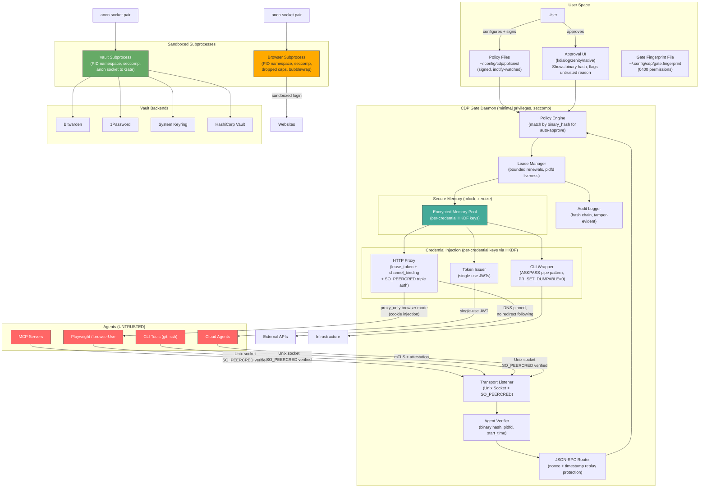

## 2. Component Design

### 2.1 Transport Listener & Agent Verification

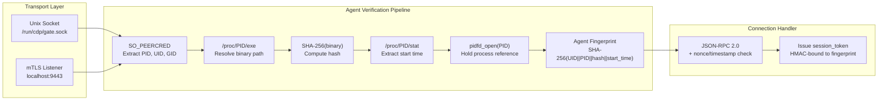

**Implementation notes:**
- `SO_PEERCRED` extracts PID/UID from the Unix socket — agent cannot fake this
- Binary path resolved via `/proc/<PID>/exe` symlink — agent cannot spoof this
- Binary hash is SHA-256 of the actual binary file — not self-declared
- Process start time from `/proc/<PID>/stat` field 22 — prevents PID recycling
- `pidfd_open()` holds a kernel reference — instant death notification, no polling window
- Agent fingerprint is a composite hash of all verification data
- `session_token = HMAC-SHA256(gate_key, fingerprint || connection_id)` — must be presented on all subsequent calls

### 2.2 Policy Engine

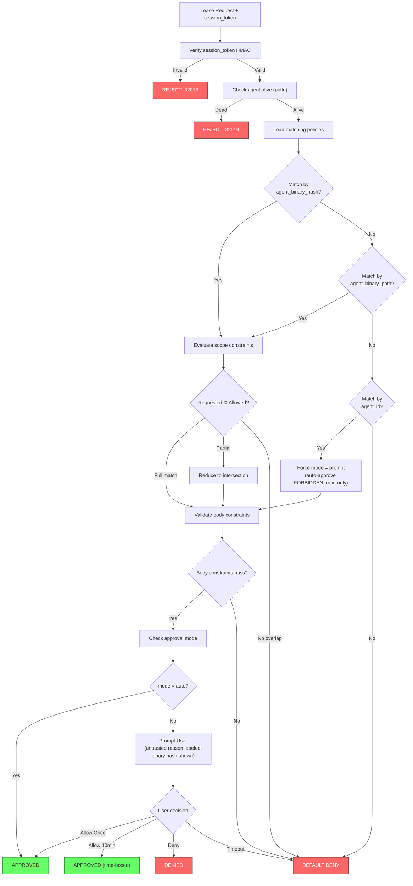

**Policy integrity:**
- Policy directory watched via `inotify(IN_MODIFY | IN_CREATE | IN_DELETE)`
- On change: re-read all policies, check integrity
- If `policy_signing = true` in config: verify Ed25519 signature on each policy file
- Log the PID/binary of the process that made the modification
- Non-interactive modifier → SECURITY ALERT in audit log

### 2.3 Lease Manager

**Lease state machine:**

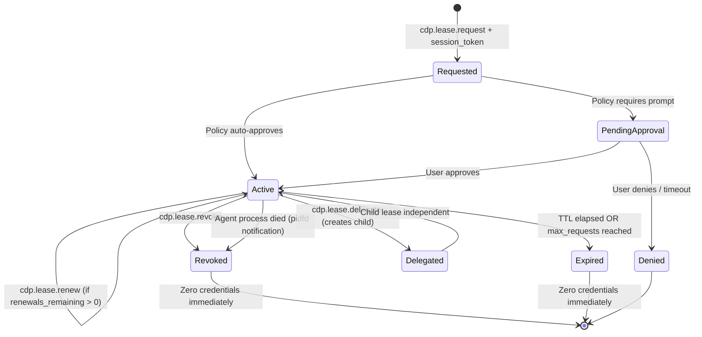

**Key properties:**
- Leases stored in memory only (never persisted to disk)
- Each lease has a cryptographic ID (random 256-bit, not 128-bit)
- Lease includes: `agent_fingerprint`, `channel_binding_nonce`, `lease_token`, `dns_pinned_ips`, `renewals_remaining`, `cumulative_ttl_remaining`
- Process liveness via `pidfd` — immediate revocation on agent death, zero window
- Renewal hard limits: `max_renewals` (default 3), `max_cumulative_ttl` (default 4h)
- Parent revocation cascades to all children (depth-first traversal, immediate)

### 2.4 Encrypted Memory Pool

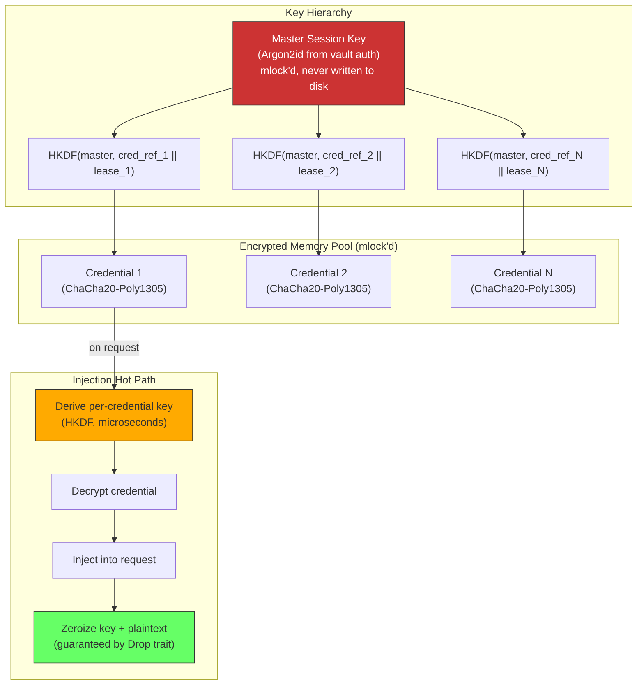

**Implementation details:**
- **Per-credential key isolation** — each credential encrypted with `HKDF-SHA256(master, credential_ref || lease_id)`. Compromising one key exposes one credential.
- All credential memory is `mlock()`'d (prevents swap)
- Uses `zeroize` crate for guaranteed memory clearing (Rust `Drop` trait)
- `ChaCha20-Poly1305` for authenticated encryption (detects tampering)
- Master key derived from vault authentication via `Argon2id`
- Decrypted credentials + derived keys exist in memory for microseconds, then zeroized
- Core dumps disabled: `PR_SET_DUMPABLE=0` + `RLIMIT_CORE=0`

### 2.5 HTTP Proxy

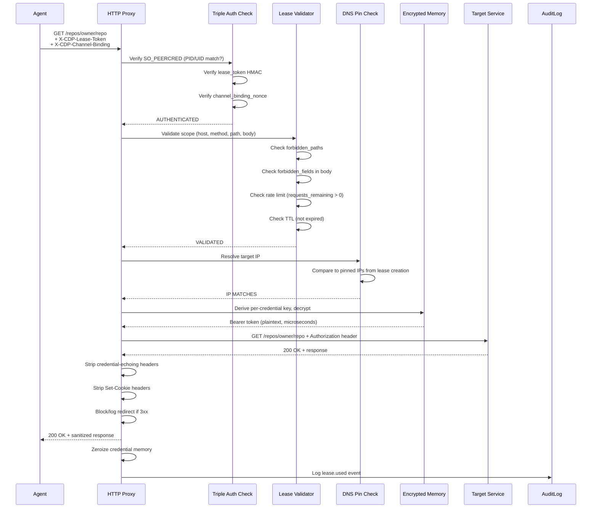

**Per-lease proxy design:**
- **Triple authentication** on every request: SO_PEERCRED + lease_token HMAC + channel_binding_nonce
- **Full scope validation**: host, path, method, body constraints, forbidden paths, content type
- **DNS pinning**: IPs resolved at lease creation, verified on every request
- **No redirect following** by default; if enabled, validates redirect target against allowed hosts
- **Response sanitization**: strips Authorization echoes, Set-Cookie, WWW-Authenticate credential hints
- Rate limiting per-lease with atomic counter

### 2.6 Browser Session Manager

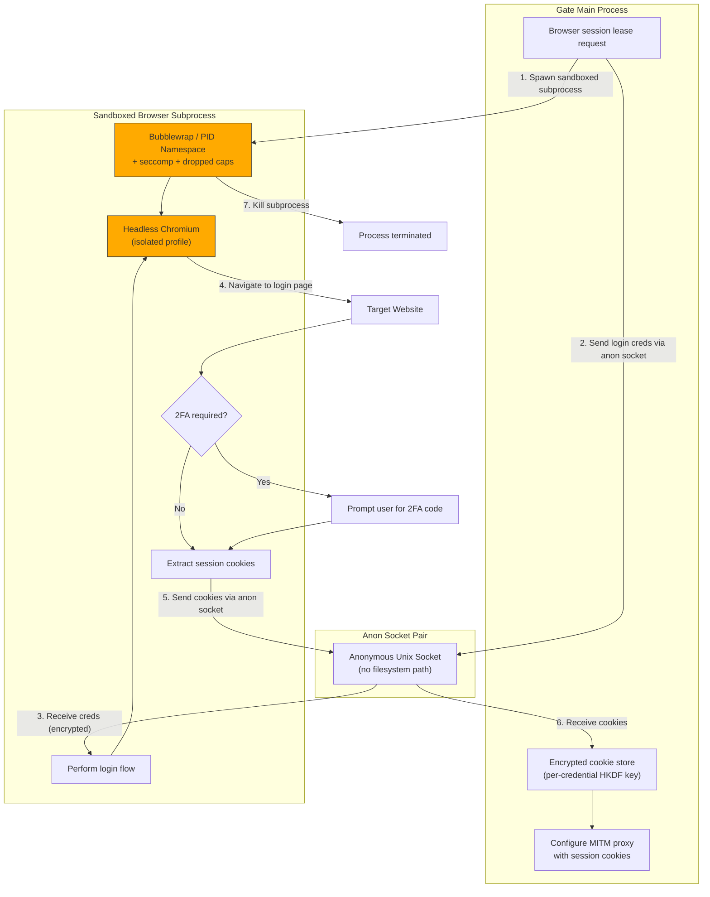

**Browser security design:**

**Subprocess sandboxing:**
- Browser subprocess launched via `bubblewrap` (or `unshare` fallback):
  - New PID namespace (`CLONE_NEWPID`)
  - New network namespace (only loopback + explicit proxy route)
  - Seccomp filter: block `ptrace`, `process_vm_readv`, `process_vm_writev`, `mount`, `pivot_root`
  - Dropped capabilities: no `CAP_SYS_PTRACE`, `CAP_NET_RAW`, `CAP_SYS_ADMIN`
  - Read-only rootfs bind mount (no writes except `/tmp`)
- No access to Gate memory, vault subprocess, or Unix socket
- Communication ONLY via anonymous socket pair
- Subprocess killed immediately after cookie extraction — never kept alive

**Default proxy_only mode:**
- Agent's browser routes ALL traffic through CDP MITM proxy
- Proxy injects session cookies for matching origins
- Agent's browser context has NO cookies — they exist only in the proxy
- `Set-Cookie` response headers stripped before reaching agent
- Agent cannot exfiltrate what it does not have

**MITM CA protection:**
- CA key generated in memory, encrypted with per-lease HKDF key
- CA key exists ONLY in the MITM proxy subprocess memory
- CA certificate validity: 24 hours, auto-rotated
- CA is **name-constrained**: valid only for origins in active leases (e.g., if lease is for `app.example.com`, CA is valid only for `*.example.com`)
- CA added to browser context only — never system trust store
- All issued certificates logged in audit

### 2.7 CLI Wrapper

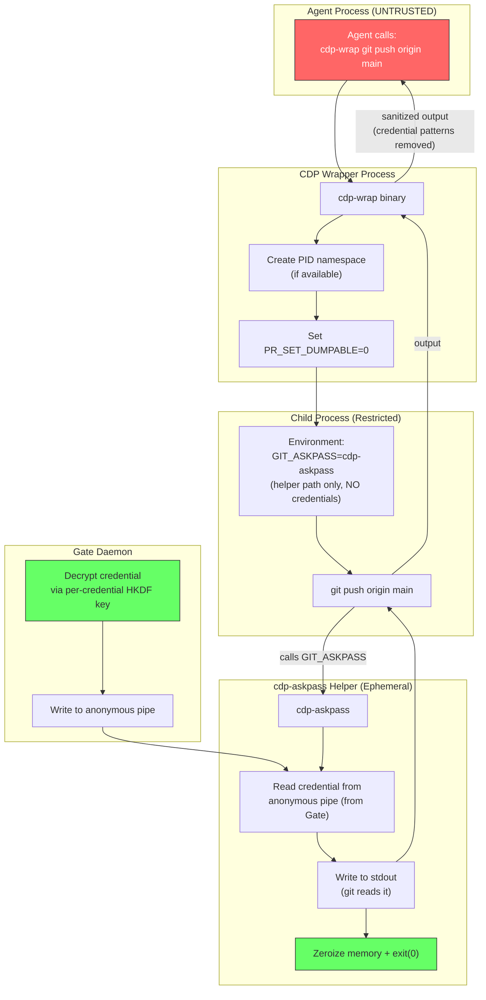

**CLI security design:**

| Security Property | How |
|---|---|
| Credentials not in CLI args | Never passed via command line (visible in `ps`) |
| Credentials not pre-loaded in env | `GIT_ASKPASS` points to helper binary, NOT the credential |
| `/proc/environ` not readable | `PR_SET_DUMPABLE=0` blocks `/proc/PID/environ` and `/proc/PID/mem` reads |
| Credential in memory briefly | `cdp-askpass` reads from pipe → writes to stdout → zeroizes → exits immediately |
| Output sanitized | Wrapper scans stdout/stderr for credential patterns before forwarding to agent |
| Process isolation | PID namespace when available; otherwise `PR_SET_DUMPABLE=0` is mandatory |

**Supported injection methods:**
| Tool | Injection Method | Credential Delivery |
|------|-----------------|---------------------|
| git | `GIT_ASKPASS` helper binary | Anonymous pipe from Gate |
| ssh | CDP-managed `SSH_AUTH_SOCK` (agent forwarding) | Gate implements SSH agent protocol on the socket |
| kubectl | Temporary `KUBECONFIG` (0600, tmpfs, deleted after exec) | Written by Gate, read by kubectl, shredded immediately |
| aws | CDP credential process (`credential_process` in config) | Gate implements the AWS credential process protocol |
| docker | Credential helper (`docker-credential-cdp`) | Gate implements Docker credential helper protocol |
| generic | cdp-askpass on anonymous pipe | Pipe from Gate, read on demand |

### 2.8 Token Issuer (AI-to-AI)

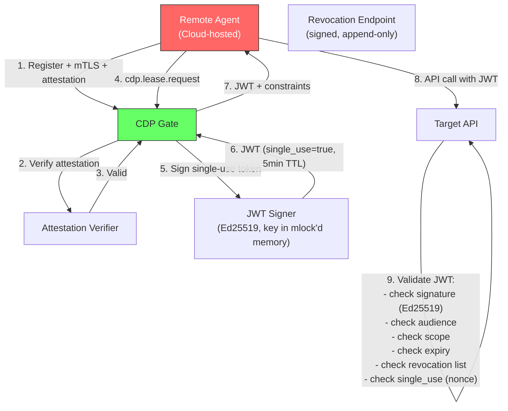

**Token security properties:**
- Ed25519 signed JWTs — signing key in mlock'd memory, never on disk
- `single_use = true` by default — JWT contains a nonce, target API checks for replay
- TTL: 1–5 minutes (configurable per policy)
- Contains: `aud` (audience), `scope`, `lease_id`, `agent_id`, `delegation_chain`, `jti` (unique ID)
- Revocation: Gate publishes signed revocation list at well-known endpoint
- Target APIs validate independently OR call Gate's introspection endpoint

## 3. Deployment Models

### 3.1 Local Desktop (Primary)

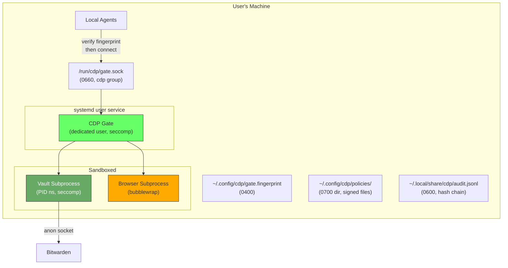

### 3.2 Development Container

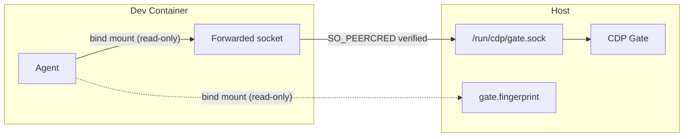

- Gate runs on host, socket and fingerprint file bind-mounted into container (read-only)
- Agent verifies fingerprint, then connects
- `SO_PEERCRED` works across mount namespaces on Linux
- Credentials never enter the container filesystem

### 3.3 Remote / Multi-Machine

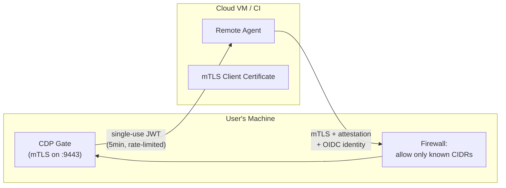

- mTLS mandatory for all remote connections
- Attestation required (OIDC, enclave, signed_code)
- Firewall restricts source IPs
- All tokens single-use, 5-minute TTL
- No delegation capability for remote agents by default

## 4. Rust Crate Structure

```
cdp/
├── Cargo.toml                  # Workspace root
├── crates/
│   ├── cdp-gate/               # Main daemon binary
│   │   ├── src/
│   │   │   ├── main.rs         # Entry point, systemd integration, seccomp setup
│   │   │   ├── listener.rs     # Unix socket + mTLS listener
│   │   │   ├── agent_verify.rs # SO_PEERCRED, binary hash, pidfd, fingerprint
│   │   │   ├── router.rs       # JSON-RPC routing, nonce/timestamp checks
│   │   │   ├── fingerprint.rs  # Gate fingerprint file management
│   │   │   └── config.rs       # Configuration loading
│   │   └── Cargo.toml
│   │
│   ├── cdp-policy/             # Policy engine
│   │   ├── src/
│   │   │   ├── lib.rs
│   │   │   ├── parser.rs       # TOML policy parsing + validation
│   │   │   ├── verifier.rs     # Ed25519 signature verification
│   │   │   ├── evaluator.rs    # Policy evaluation (binary_hash matching)
│   │   │   ├── watcher.rs      # inotify policy file monitoring
│   │   │   └── approval.rs     # User approval flows (untrusted reason display)
│   │   └── Cargo.toml
│   │
│   ├── cdp-lease/              # Lease lifecycle management
│   │   ├── src/
│   │   │   ├── lib.rs
│   │   │   ├── manager.rs      # Lease create/renew/revoke (bounded renewals)
│   │   │   ├── delegation.rs   # Delegation chain logic
│   │   │   ├── liveness.rs     # pidfd/proc agent liveness monitoring
│   │   │   ├── channel_bind.rs # Channel binding nonce generation/verification
│   │   │   └── dns_pin.rs      # DNS resolution pinning at lease creation
│   │   └── Cargo.toml
│   │
│   ├── cdp-crypto/             # Encrypted memory + crypto
│   │   ├── src/
│   │   │   ├── lib.rs
│   │   │   ├── mempool.rs      # mlock'd encrypted credential store
│   │   │   ├── hkdf.rs         # Per-credential HKDF key derivation
│   │   │   ├── cipher.rs       # ChaCha20-Poly1305 encrypt/decrypt
│   │   │   ├── hmac.rs         # Lease token + session token generation
│   │   │   └── zeroize.rs      # Guaranteed memory zeroing
│   │   └── Cargo.toml
│   │
│   ├── cdp-proxy/              # HTTP/MITM proxy
│   │   ├── src/
│   │   │   ├── lib.rs
│   │   │   ├── auth.rs         # Triple auth: SO_PEERCRED + lease_token + channel_bind
│   │   │   ├── http.rs         # HTTP proxy with header injection
│   │   │   ├── scope.rs        # Request scope validation (host, path, method, body)
│   │   │   ├── redirect.rs     # Redirect blocking/validation
│   │   │   ├── dns.rs          # DNS pin verification
│   │   │   ├── websocket.rs    # WebSocket upgrade + lifecycle management
│   │   │   ├── mitm.rs         # MITM proxy for browser sessions
│   │   │   ├── mitm_ca.rs      # Name-constrained, short-lived CA management
│   │   │   └── sanitizer.rs    # Response credential stripping
│   │   └── Cargo.toml
│   │
│   ├── cdp-browser/            # Browser session management
│   │   ├── src/
│   │   │   ├── lib.rs
│   │   │   ├── sandbox.rs      # Bubblewrap/unshare subprocess spawning
│   │   │   ├── snapshot.rs     # Session snapshot login flow (in subprocess)
│   │   │   ├── cookies.rs      # Cookie extraction/filtering
│   │   │   └── twofa.rs        # 2FA handling (user prompt)
│   │   └── Cargo.toml
│   │
│   ├── cdp-cli-wrap/           # CLI wrapper binary
│   │   ├── src/
│   │   │   ├── main.rs         # cdp-wrap entry point
│   │   │   ├── namespace.rs    # PID namespace + PR_SET_DUMPABLE setup
│   │   │   ├── exec.rs         # Wrapped command execution
│   │   │   ├── askpass.rs      # cdp-askpass helper (pipe-based, ephemeral)
│   │   │   └── sanitize.rs     # Output sanitization (credential pattern removal)
│   │   └── Cargo.toml
│   │
│   ├── cdp-vault/              # Vault backend trait + implementations
│   │   ├── src/
│   │   │   ├── lib.rs          # VaultBackend trait
│   │   │   ├── subprocess.rs   # Sandboxed vault subprocess management
│   │   │   ├── bitwarden.rs    # Bitwarden implementation (session in subprocess only)
│   │   │   ├── onepassword.rs  # 1Password implementation
│   │   │   ├── keyring.rs      # System keyring implementation
│   │   │   └── file.rs         # File-based (dev/testing only)
│   │   └── Cargo.toml
│   │
│   ├── cdp-token/              # JWT token issuance (AI-to-AI)
│   │   ├── src/
│   │   │   ├── lib.rs
│   │   │   ├── issuer.rs       # JWT signing (single-use nonce)
│   │   │   ├── validator.rs    # JWT validation
│   │   │   └── revocation.rs   # Signed, append-only revocation list
│   │   └── Cargo.toml
│   │
│   ├── cdp-audit/              # Audit logging
│   │   ├── src/
│   │   │   ├── lib.rs
│   │   │   ├── logger.rs       # Structured event logging (hash chain)
│   │   │   ├── integrity.rs    # Hash chain verification on startup
│   │   │   └── export.rs       # Log export (JSON, syslog, remote SIEM)
│   │   └── Cargo.toml
│   │
│   └── cdp-sdk/                # Client SDK for agent developers
│       ├── src/
│       │   ├── lib.rs
│       │   ├── client.rs       # CDP Gate client
│       │   ├── discover.rs     # Gate discovery + fingerprint verification
│       │   ├── lease.rs        # Lease request helpers (with lease_token management)
│       │   └── proxy.rs        # Proxy request helpers (auto-inject CDP headers)
│       └── Cargo.toml
│
├── cdp-askpass/                 # GIT_ASKPASS helper binary (minimal, ephemeral)
├── policies/                    # Example policy files (with signatures)
└── docs/                        # Additional documentation
```

## 5. Key Dependencies (Rust)

| Crate | Purpose |
|-------|---------|
| `tokio` | Async runtime |
| `hyper` | HTTP proxy implementation |
| `rustls` | TLS (proxy + mTLS listener) |
| `chacha20poly1305` | Credential encryption |
| `hkdf` + `sha2` | Per-credential key derivation |
| `hmac` | Lease token + session token generation |
| `zeroize` | Guaranteed memory zeroing |
| `jsonrpsee` | JSON-RPC 2.0 server/client |
| `serde` / `toml` | Policy file parsing |
| `ed25519-dalek` | JWT signing + policy signing |
| `tracing` | Structured logging |
| `headless_chrome` | Browser session management (in subprocess) |
| `argon2` | Master session key derivation |
| `nix` | Unix socket, mlock, SO_PEERCRED, pidfd, namespaces |
| `inotify` | Policy file monitoring |
| `seccomp-sys` | System call filtering |
| `bubblewrap` (system) | Browser subprocess sandboxing |
| `uuid` | Nonce generation (v4) |

## 6. Configuration

```toml
# ~/.config/cdp/gate.toml

[gate]
socket_path = "/run/cdp/gate.sock"
log_level = "info"
audit_log_path = "~/.local/share/cdp/audit.jsonl"
fingerprint_path = "~/.config/cdp/gate.fingerprint"

[gate.tls]
enabled = false  # Enable for remote access
cert_path = "~/.config/cdp/gate.crt"
key_path = "~/.config/cdp/gate.key"
client_ca_path = "~/.config/cdp/client-ca.crt"

[vault]
backend = "bitwarden"
subprocess_sandbox = true  # Run vault in isolated subprocess

[vault.bitwarden]
cli_path = "/usr/bin/bw"
session_timeout_minutes = 60

[approval]
default_method = "gui"
gui_command = "kdialog"
timeout_seconds = 30
cooldown_seconds = 5           # Min time between approval prompts (anti-fatigue)
show_binary_hash = true        # Show agent binary hash in approval dialog
label_reason_untrusted = true  # Mark agent-provided reason as unverified
max_reason_length = 200        # Truncate reason field

[security]
max_delegation_depth = 3
default_lease_ttl_seconds = 3600
max_lease_ttl_seconds = 86400
max_renewals_per_lease = 3
max_cumulative_ttl_seconds = 14400  # 4 hours
remote_max_ttl_seconds = 300
remote_single_use = true
encrypted_memory = true
per_credential_keys = true     # HKDF per-credential key derivation
disable_core_dumps = true
require_binary_hash_for_auto = true  # Reject auto-approve without binary hash
policy_signing = false         # Enable Ed25519 policy signing
policy_signing_key = ""
nonce_window_seconds = 300     # Replay detection window
nonce_max_entries = 100000     # Max stored nonces

[security.dns]
pin_at_lease_creation = true   # Pin DNS resolutions
allow_dynamic_dns = false      # Require explicit policy opt-in for dynamic DNS

[security.proxy]
follow_redirects = false       # Default: block redirects
strip_set_cookie = true        # Strip Set-Cookie from proxy responses
strip_auth_echo = true         # Strip Authorization echoes from responses

[proxy]
bind_address = "127.0.0.1"
port_range = "19000-19999"

[browser]
sandbox_method = "bubblewrap"  # "bubblewrap", "unshare", "none" (not recommended)
default_mode = "proxy_only"    # "proxy_only", "scoped_snapshot", "full_snapshot"
mitm_ca_validity_hours = 24
mitm_ca_name_constrained = true
kill_after_snapshot = true     # Kill browser subprocess after cookie extraction
```

## 7. Integration Examples

### 7.1 MCP Server Using CDP

```typescript
import { CdpClient } from '@cdp-protocol/sdk';

// SDK auto-discovers Gate via socket, verifies fingerprint file
const cdp = new CdpClient();

const lease = await cdp.requestLease({
  credentialRef: 'github_api',
  scope: {
    hosts: ['api.github.com'],
    methods: ['GET'],
    paths: ['/repos/**'],
    forbiddenPaths: ['/repos/*/keys', '/repos/*/hooks'],
    ttlSeconds: 600,
  },
  reason: 'Fetching repository information for user query',
});

// SDK auto-includes X-CDP-Lease-Token and X-CDP-Channel-Binding
const response = await lease.fetch('/repos/owner/repo');
// Equivalent to:
// fetch(`${lease.proxyUrl}/repos/owner/repo`, {
//   headers: {
//     'X-CDP-Lease-Token': lease.leaseToken,
//     'X-CDP-Channel-Binding': lease.channelBindingNonce,
//   }
// });
```

### 7.2 Playwright Using CDP (proxy_only mode)

```typescript
import { chromium } from 'playwright';
import { CdpClient } from '@cdp-protocol/sdk';

const cdp = new CdpClient();

// Gate logs in via sandboxed subprocess, configures MITM proxy
// NO cookies returned to agent — all injected via proxy
const session = await cdp.requestBrowserSession({
  credentialRef: 'app_login',
  origins: ['https://app.example.com'],
  mode: 'proxy_only',  // DEFAULT — agent never sees cookies
  ttlSeconds: 1800,
});

const browser = await chromium.launch();
const context = await browser.newContext({
  proxy: { server: session.proxyUrl },  // Route ALL traffic through CDP proxy
  // NO cookies injected — proxy handles authentication
});

const page = await context.newPage();
await page.goto('https://app.example.com/dashboard');
// Agent is authenticated. Proxy injected cookies transparently.
// Agent has NO cookies, NO credentials, NO session tokens.
```

### 7.3 CLI Tool Using CDP

```bash
# cdp-wrap handles everything securely:
# 1. Requests CLI lease (verified by binary hash)
# 2. Spawns git in PID namespace with PR_SET_DUMPABLE=0
# 3. GIT_ASKPASS helper reads credentials from anonymous pipe
# 4. Helper zeroes memory and exits immediately after
# 5. Output sanitized before returning to caller
cdp-wrap git push origin main
```
