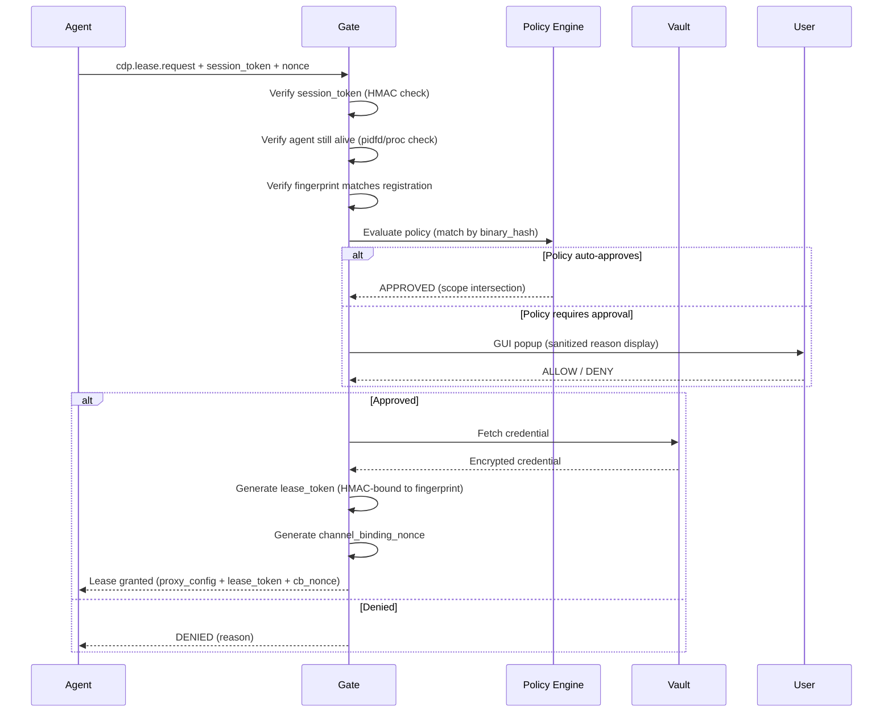
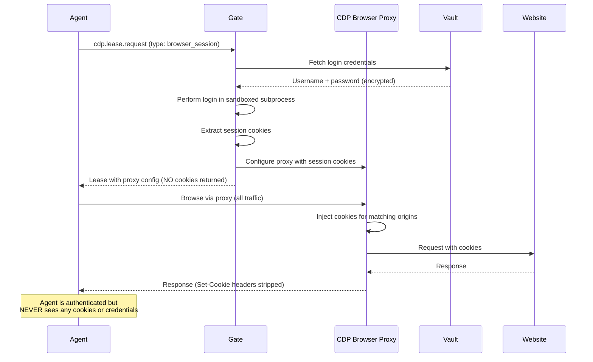
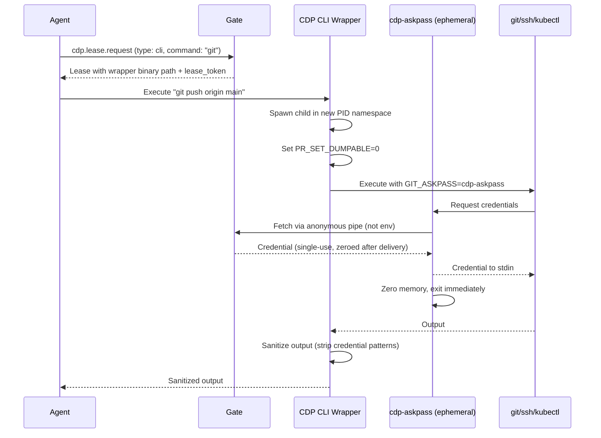
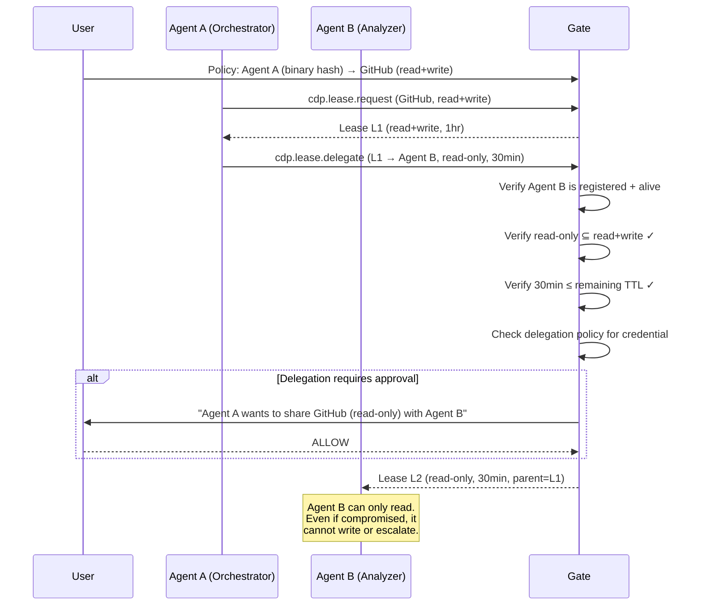
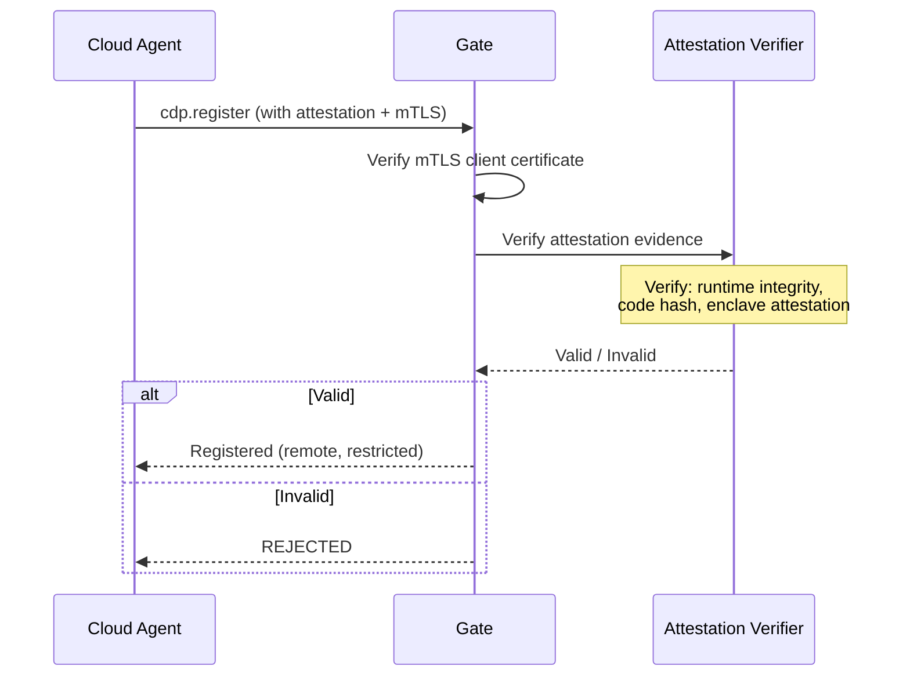

# CDP Protocol Specification

**Version:** 0.2.0-draft
**Status:** Draft
**Date:** 2026-04-07

## 1. Overview

The Credential Delegation Protocol (CDP) defines a standard way for AI agents to use credentials **without ever accessing them directly**. A local daemon called the **CDP Gate** mediates all credential access, injecting authentication material at the transport layer while keeping agents zero-knowledge.

### 1.1 Terminology

| Term | Definition |
|------|-----------|
| **Agent** | Any software that needs credentials to act on a user's behalf (MCP server, browser automation, CLI tool, cloud-hosted AI) |
| **Gate** | The CDP daemon that holds credentials and injects them into requests |
| **Vault Backend** | The secrets store (Bitwarden, 1Password, system keyring, HashiCorp Vault) |
| **Policy** | A set of rules defining what an agent can access, for how long, and under what conditions |
| **Credential Lease** | A time-bound, scope-limited authorization for an agent to use a credential through the Gate |
| **Delegation Chain** | A sequence of scoped sub-delegations from user → agent A → agent B |
| **Agent Fingerprint** | A cryptographic identity derived from the agent's binary hash + PID + UID, verified by the Gate |
| **Lease Token** | A cryptographic bearer token (HMAC-derived) that binds a lease to a specific agent fingerprint and proxy session |
| **Channel Binding Nonce** | A one-time nonce that ties the JSON-RPC control channel to the HTTP proxy data channel |

### 1.2 Design Goals

1. Agents MUST NOT receive raw credentials at any point
2. All credential usage MUST be auditable with tamper-evident logs
3. Credential access MUST be scoped by time, action, target, and request content
4. The protocol MUST support user approval flows (interactive and policy-based)
5. The protocol MUST be transport-agnostic (HTTP, SSH, WebSocket, CLI)
6. The protocol MUST support delegation chains with scope reduction
7. The protocol MUST authenticate agents cryptographically, not by self-declaration
8. The protocol MUST bind control channel identity to data channel usage (channel binding)
9. The protocol MUST protect against local process impersonation, PID recycling, and env poisoning

## 2. Transport & Discovery

### 2.1 Gate Discovery

Agents discover the CDP Gate through a **verified** two-tier mechanism:

1. **Well-known Unix socket** — default: `/run/cdp/gate.sock` (Linux), `~/Library/Application Support/cdp/gate.sock` (macOS). **This is the preferred and most secure method.**
2. **Environment variable** `CDP_GATE_URL` — override for containers or remote setups.

**Gate Verification**

The Unix socket is the trust anchor. When the Gate starts, it writes a **Gate fingerprint file** to a user-owned, permission-restricted path:

```
~/.config/cdp/gate.fingerprint
```

Contents:
```json
{
  "gate_pid": 9999,
  "gate_binary_hash": "sha256:abc123...",
  "public_key": "ed25519:...",
  "socket_path": "/run/cdp/gate.sock",
  "started_at": "2026-04-07T14:00:00Z"
}
```

- File permissions: `0400` (read-only by owner)
- Directory permissions: `0700`
- SDKs MUST verify the fingerprint file before connecting to `CDP_GATE_URL`
- If `CDP_GATE_URL` points to a socket, the SDK MUST verify `SO_PEERCRED` matches `gate_pid`
- If `CDP_GATE_URL` points to HTTPS, the SDK MUST verify the Gate's TLS certificate contains the `public_key` from the fingerprint file
- If the fingerprint file is missing or stale (Gate PID no longer running), the SDK MUST refuse to connect

```
CDP_GATE_URL=unix:///run/cdp/gate.sock      # Unix socket (default, most secure)
CDP_GATE_URL=https://localhost:9443          # Local HTTPS — fingerprint-verified
CDP_GATE_URL=https://gate.internal:9443      # Remote gate (AI-to-AI, mTLS required)
```

### 2.2 Transport Protocol

Communication between agents and the Gate uses **JSON-RPC 2.0** over the discovered transport.

**Replay Protection**

Every JSON-RPC request MUST include a `nonce` and `timestamp` in the params:

```json
{
  "jsonrpc": "2.0",
  "method": "cdp.lease.request",
  "params": {
    "nonce": "random-uuid-v4",
    "timestamp": "2026-04-07T14:00:00.123Z",
    ...
  },
  "id": 2
}
```

- Gate MUST reject requests with timestamps older than 30 seconds
- Gate MUST reject duplicate nonces within a sliding window (5 minutes)
- Gate MUST store seen nonces in a bounded set (LRU, max 100k entries)

### 2.3 Agent Authentication

**Agent Fingerprinting**

Agent identity is NOT self-declared. The Gate derives it cryptographically:

```json
{
  "jsonrpc": "2.0",
  "method": "cdp.register",
  "params": {
    "agent_id": "mcp-github-server",
    "agent_version": "1.2.0",
    "capabilities": ["http_proxy", "cli_wrap"],
    "attestation": null,
    "nonce": "uuid-v4",
    "timestamp": "2026-04-07T14:00:00Z"
  },
  "id": 1
}
```

The Gate performs the following verification (the agent does NOT supply PID — the Gate reads it from the socket):

1. **SO_PEERCRED** — extract PID, UID, GID from the Unix socket connection
2. **Binary path resolution** — read `/proc/<PID>/exe` to get the agent's binary path
3. **Binary hash** — compute SHA-256 of the binary at that path
4. **Cmdline verification** — read `/proc/<PID>/cmdline` to verify agent_id plausibility
5. **Start time** — read `/proc/<PID>/stat` to get process start time

The Gate constructs an **Agent Fingerprint**:

```
fingerprint = SHA-256(UID || PID || binary_hash || process_start_time)
```

This fingerprint is:
- Bound to the registration
- Checked on every subsequent JSON-RPC call and proxy request
- Invalidated if the process dies (detected via `/proc/<PID>/stat` polling or pidfd)

**Registration Response:**

```json
{
  "jsonrpc": "2.0",
  "result": {
    "status": "registered",
    "agent_fingerprint": "sha256:...",
    "session_token": "cdp_sess_...",
    "capabilities_granted": ["http_proxy", "cli_wrap"]
  },
  "id": 1
}
```

The `session_token` MUST be included in all subsequent JSON-RPC requests as proof of registration. It is HMAC-bound to the agent fingerprint and the Unix socket connection.

**PID Recycling Prevention**

- The Gate uses `pidfd_open()` (Linux 5.3+) to hold a file descriptor to the agent process
- If `pidfd_open` is unavailable, the Gate polls `/proc/<PID>/stat` start time every 2 seconds
- If the PID dies or start time changes, all registrations and leases for that PID are immediately revoked
- Leases are NEVER reaped on a timer alone — process liveness is continuously verified

### 2.4 Policy Matching

**Policy Matching by Agent Fingerprint**

Policies can match by:
- `agent_binary_hash` — the SHA-256 of the agent's binary (strongest)
- `agent_binary_path` — the resolved path from `/proc/<PID>/exe` (medium)
- `agent_id` — self-declared name (weakest, ONLY for `mode = "prompt"` policies)

Auto-approve policies (`mode = "auto"`) MUST match by `agent_binary_hash` or `agent_binary_path`. They MUST NOT match by `agent_id` alone. The Gate MUST reject policy files that define auto-approve with only `agent_id` matching.

```toml
# VALID: auto-approve by binary hash
[[policy]]
name = "github-readonly"
[policy.match]
agent_binary_hash = "sha256:abc123..."
credential_ref = "github_api"
[policy.approval]
mode = "auto"

# VALID: prompt by agent_id (human verifies)
[[policy]]
name = "unknown-agent"
[policy.match]
agent_id = "some-agent"
credential_ref = "*"
[policy.approval]
mode = "prompt"

# INVALID: Gate rejects this — auto-approve with only agent_id
[[policy]]
name = "dangerous"
[policy.match]
agent_id = "mcp-github-server"
credential_ref = "github_api"
[policy.approval]
mode = "auto"  # ERROR: auto requires agent_binary_hash or agent_binary_path
```

## 3. Credential Types

CDP defines credential types that map to how credentials are injected, not how they are stored.

### 3.1 HTTP Credentials

Injected as headers into HTTP requests routed through the Gate proxy.

```json
{
  "type": "http",
  "target": {
    "hosts": ["api.github.com"],
    "paths": ["/repos/owner/*"],
    "methods": ["GET", "POST"],
    "request_body_constraints": {
      "max_size_bytes": 65536,
      "forbidden_fields": ["deploy_key", "admin"],
      "allowed_content_types": ["application/json"]
    }
  },
  "injection": {
    "headers": {
      "Authorization": "Bearer {{secret:github_pat}}"
    }
  }
}
```

**Request Body Validation**

Scope validation MUST extend beyond host/path/method:
- `request_body_constraints.forbidden_fields` — reject requests whose JSON body contains these keys (prevents scope escalation via API misuse, e.g., creating deploy keys through an endpoint that also serves reads)
- `request_body_constraints.max_size_bytes` — prevent large uploads through scoped endpoints
- `request_body_constraints.allowed_content_types` — restrict Content-Type header
- Query parameters are validated against `paths` patterns (path includes query string in matching)

### 3.2 Browser Session Credentials

**Browser Sessions Are Scoped, Not Zero-Knowledge**

Session cookies are authentication material. CDP does NOT claim zero-knowledge for browser sessions. Instead, browser sessions use a **defense-in-depth** approach:

```json
{
  "type": "browser_session",
  "target": {
    "origins": ["https://app.example.com"],
    "login_flow": "vault_entry:example_login"
  },
  "injection": {
    "mode": "proxy_only",
    "artifacts": []
  },
  "browser_security": {
    "cookie_delivery": "proxy_injection",
    "cookie_scope": "session_only",
    "cookie_ttl_seconds": 900,
    "isolate_from_agent": true
  }
}
```

**Browser credential modes (from most to least secure):**

| Mode | Agent Sees Cookies? | How It Works |
|------|-------------------|-------------|
| `proxy_only` (DEFAULT) | No | All browser traffic routed through CDP MITM proxy. Proxy injects cookies. Agent never touches cookies. |
| `scoped_snapshot` | Yes (limited) | Gate creates session, gives agent only HttpOnly-stripped, domain-restricted, short-TTL cookies. Least privilege. |
| `full_snapshot` | Yes (all) | Gate gives agent full cookie jar. **Requires explicit policy flag `allow_cookie_exposure = true` and user approval.** |

The default mode (`proxy_only`) routes ALL browser HTTP traffic through the CDP proxy. The proxy adds session cookies to matching origins. The agent's browser context has NO cookies — they exist only in the proxy.

### 3.3 CLI Credentials

Injected into CLI tool invocations via environment variables or config files.

```json
{
  "type": "cli",
  "target": {
    "commands": ["git", "ssh"],
    "args_pattern": ["*github.com*"],
    "forbidden_args": ["--upload-pack", "--receive-pack"]
  },
  "injection": {
    "env": {
      "GIT_ASKPASS": "{{cdp_helper}}",
      "SSH_AUTH_SOCK": "{{cdp_ssh_agent}}"
    }
  }
}
```

**/proc/environ Defense**

- CLI wrapper MUST spawn the child process in a new PID namespace (via `clone(CLONE_NEWPID)`) when available
- If PID namespaces are unavailable, the wrapper MUST use a short-lived helper process: credential is passed via an anonymous pipe (not env), helper writes to tool's stdin, then exits
- The wrapper MUST set `PR_SET_DUMPABLE` to 0 on the child process to prevent `/proc/<PID>/environ` reads by other same-UID processes
- Credential env vars MUST be unset from the child's environment immediately after the tool reads them (via `GIT_ASKPASS` callback pattern — credential is fetched on demand, not pre-loaded)

### 3.4 Token Credentials (AI-to-AI)

Short-lived, scoped tokens issued to remote agents.

```json
{
  "type": "token",
  "target": {
    "services": ["api.example.com"],
    "scopes": ["read:data", "write:data"]
  },
  "injection": {
    "format": "jwt",
    "audience": "api.example.com",
    "ttl_seconds": 300,
    "single_use": true
  }
}
```

## 4. Core Protocol Flows

### 4.1 Credential Lease Request



#### Request Message

```json
{
  "jsonrpc": "2.0",
  "method": "cdp.lease.request",
  "params": {
    "session_token": "cdp_sess_...",
    "nonce": "uuid-v4",
    "timestamp": "2026-04-07T14:00:00Z",
    "credential_ref": "github_api",
    "scope": {
      "hosts": ["api.github.com"],
      "methods": ["GET"],
      "paths": ["/repos/owner/repo/pulls"],
      "ttl_seconds": 600,
      "max_requests": 10
    },
    "reason": "Fetching open PRs for code review"
  },
  "id": 2
}
```

#### Response Message

```json
{
  "jsonrpc": "2.0",
  "result": {
    "lease_id": "lease_a1b2c3d4",
    "status": "granted",
    "expires_at": "2026-04-07T15:10:00Z",
    "proxy": {
      "type": "http",
      "url": "http://127.0.0.1:19042/cdp/proxy",
      "lease_token": "cdp_lt_...",
      "channel_binding_nonce": "cb_nonce_..."
    },
    "constraints": {
      "max_requests": 10,
      "max_renewals": 3,
      "max_cumulative_ttl_seconds": 3600,
      "allowed_hosts": ["api.github.com"],
      "allowed_methods": ["GET"],
      "allowed_paths": ["/repos/owner/repo/pulls"]
    }
  },
  "id": 2
}
```

**Channel Binding**

The `channel_binding_nonce` ties the JSON-RPC session to the HTTP proxy session:

1. Gate generates a random 256-bit nonce at lease creation
2. Agent receives the nonce in the lease response
3. Agent MUST include it as `X-CDP-Channel-Binding: <nonce>` header on every proxy request
4. Proxy MUST also verify `SO_PEERCRED` on the proxy connection matches the lease's agent fingerprint
5. If either check fails → `403 Forbidden` + audit log alert

**Proxy Authentication**

The `lease_token` is a bearer token that authenticates proxy requests:

```
lease_token = HMAC-SHA256(gate_session_key, lease_id || agent_fingerprint || channel_binding_nonce)
```

Every HTTP request through the proxy MUST include:
- `X-CDP-Lease-Token: <lease_token>` — proves the caller holds the lease
- `X-CDP-Channel-Binding: <channel_binding_nonce>` — proves control+data channel are the same agent
- The proxy also verifies `SO_PEERCRED` matches expected UID/PID

A local process that doesn't hold both secrets AND have the right PID/UID cannot use the proxy.

### 4.2 Browser Session Flow



### 4.3 CLI Wrapper Flow



### 4.4 Lease Renewal & Revocation

**Bounded Renewals**

```json
{
  "jsonrpc": "2.0",
  "method": "cdp.lease.renew",
  "params": {
    "session_token": "cdp_sess_...",
    "nonce": "uuid-v4",
    "timestamp": "2026-04-07T14:05:00Z",
    "lease_id": "lease_a1b2c3d4",
    "extend_seconds": 300
  },
  "id": 3
}
```

Renewal constraints (all enforced by Gate, non-negotiable):
- `max_renewals` — maximum number of times a lease can be renewed (default: 3)
- `max_cumulative_ttl_seconds` — total lease lifetime including all renewals (default: 4 hours)
- Each renewal requires a live agent (pidfd/proc check)
- Each renewal is logged as a separate audit event
- Policy can set `renewable = false` to disable renewals entirely

## 5. Policy Engine

### 5.1 Policy File Integrity

**Policy File Integrity**

Policy files are protected against modification by compromised agents:

1. **Filesystem permissions** — `~/.config/cdp/policies/` directory is `0700`, files are `0600`
2. **Inotify monitoring** — Gate watches the policy directory for changes. On modification:
   - Gate re-reads and re-validates all policies
   - If the modifying process is NOT the user's shell/editor (checked via inotify + `/proc/<PID>/exe`), Gate logs a **SECURITY ALERT** and optionally locks policies
3. **Optional: Policy signing** — policies can be signed with the user's Ed25519 key. Gate rejects unsigned or tampered policies when signing is enabled:

```toml
# ~/.config/cdp/gate.toml
[security]
policy_signing = true
policy_signing_key = "~/.config/cdp/policy-signing.pub"
```

4. **Immutable flag** — on Linux, policies can be marked immutable with `chattr +i` after writing. Gate documents this in setup guide.

### 5.2 Policy Format

```toml
# ~/.config/cdp/policies/github.toml

[[policy]]
name = "github-readonly"
description = "Allow MCP GitHub server read-only API access"

[policy.match]
agent_binary_hash = "sha256:abc123..."  # REQUIRED for auto-approve
credential_ref = "github_api"

[policy.allow]
hosts = ["api.github.com"]
methods = ["GET"]
paths = ["/repos/**", "/users/**"]
forbidden_paths = ["/repos/*/keys", "/repos/*/hooks"]  # Deny deploy key creation
max_ttl_seconds = 3600
max_requests_per_lease = 100
max_renewals = 3
max_cumulative_ttl_seconds = 7200
renewable = true

[policy.allow.body_constraints]
forbidden_fields = ["admin", "deploy_key", "delete"]
max_size_bytes = 65536

[policy.allow.network]
follow_redirects = false           # DEFAULT: do not follow redirects
dns_resolution = "pinned"          # Pin DNS at lease creation time
allowed_ip_ranges = []             # Empty = allow all, but see dns_resolution

[policy.approval]
mode = "auto"

[policy.delegation]
allowed = true
max_depth = 2
require_approval_for_delegate = false
```

### 5.3 Policy Evaluation Order

1. Exact match policies by `agent_binary_hash` + `credential_ref` (strongest)
2. Exact match by `agent_binary_path` + `credential_ref`
3. Wildcard policies matching `agent_id` (ONLY for `mode = "prompt"`)
4. Default deny if no policy matches

### 5.4 Credential Reference Visibility

**Credential Reference Visibility**

`cdp.credentials.list` is a privileged operation:

- Returns only credential references that the agent's matched policy explicitly allows
- Unknown/unmatched agents receive an empty list
- The response NEVER reveals credential references the agent has no policy for
- Rate-limited to 1 call per 60 seconds per agent

```json
// Agent with github-readonly policy sees:
{"result": {"credentials": ["github_api"]}}

// Unknown agent sees:
{"result": {"credentials": []}}
```

### 5.5 Approval UI Safety

**Approval UI Safety**

The `reason` field from the agent is displayed but marked as **untrusted**:

```
┌─────────────────────────────────────────────────────┐
│  CDP Credential Request                             │
│                                                     │
│  Agent:       /usr/bin/node (PID 8821)              │
│  Binary Hash: sha256:abc123...                      │
│  Credential:  slack_bot_token                       │
│  Scope:       POST to api.slack.com/chat.*          │
│  Duration:    10 minutes, max 50 requests           │
│                                                     │
│  ⚠ Agent-provided reason (unverified):              │
│  ┌─────────────────────────────────────────────┐    │
│  │ "Posting daily standup summary"             │    │
│  └─────────────────────────────────────────────┘    │
│                                                     │
│  ⚠ This agent has no auto-approve policy.           │
│  First request from this binary.                    │
│                                                     │
│         [Allow Once]  [Allow 10min]  [Deny]         │
└─────────────────────────────────────────────────────┘
```

Key UX requirements:
- Reason is visually separated and labeled "unverified" / "agent-provided"
- Binary path and hash are shown (not just self-declared agent_id)
- First-time agents are flagged prominently
- "Allow Once" is the default (not "Allow" with no time bound)
- The dialog MUST NOT be auto-dismissible by the agent
- Maximum reason length: 200 characters (prevents UI overflow attacks)

## 6. Delegation Chains

### 6.1 Delegation Flow



### 6.2 Delegation Rules

1. Delegated scope MUST be a **strict subset** of the parent lease
2. Delegated TTL MUST NOT exceed the parent lease's **remaining** TTL
3. Maximum delegation depth: configurable, default 3
4. Revoking a parent lease MUST cascade to ALL child leases
5. **Delegation to unregistered agents is forbidden** — delegate target must have an active, verified registration
6. **Policy controls delegation** — `policy.delegation.require_approval_for_delegate` can force user approval for every delegation
7. Each delegation creates a signed audit trail entry linking parent → child

## 7. AI-to-AI Credential Flow

### 7.1 Remote Agent Attestation

Remote agents MUST prove their identity before receiving credential access:



### 7.2 Attestation Types

| Type | Description | Trust Level |
|------|-------------|-------------|
| `none` | No attestation (local agents only, REJECTED for remote) | Local only |
| `mtls` | Mutual TLS with pre-shared client cert | Medium |
| `oidc` | OIDC identity token from trusted IdP | Medium-High |
| `enclave` | TEE attestation (SGX, Nitro, SEV) | High |
| `signed_code` | Signed binary hash + runtime measurement | High |

### 7.3 Remote Lease Constraints

Remote agents receive additional restrictions:
- Shorter maximum TTL (default: 5 minutes)
- Lower rate limits
- No delegation capability (unless explicitly policy-approved)
- All requests are logged with remote agent metadata (source IP, attestation type)
- `single_use = true` by default for tokens — each JWT can only be used once

### 7.4 Token Issuance for Remote Agents

```json
{
  "jsonrpc": "2.0",
  "result": {
    "lease_id": "lease_remote_x1y2z3",
    "status": "granted",
    "token": {
      "format": "jwt",
      "value": "eyJhbGciOiJFZDI1NTE5...",
      "expires_at": "2026-04-07T15:05:00Z",
      "single_use": true
    },
    "constraints": {
      "audience": "api.example.com",
      "scopes": ["read:data"],
      "max_requests": 1
    }
  },
  "id": 6
}
```

## 8. HTTP Proxy Security

**Redirect Handling**

The proxy MUST NOT follow HTTP redirects by default. If the target returns 3xx:
- Proxy returns the redirect response to the agent **without** the `Location` header containing credentials
- If the policy explicitly allows `follow_redirects = true`, the proxy follows BUT validates the redirect target against the lease's allowed hosts
- Redirects to hosts outside the lease scope are blocked and logged

**DNS Pinning**

- At lease creation, the Gate resolves all allowed hostnames to IP addresses
- These IPs are **pinned** for the lifetime of the lease
- Every proxy request verifies the resolved IP matches the pinned IP
- If DNS changes during the lease, the request is blocked and logged
- Policy can set `dns_resolution = "dynamic"` to allow re-resolution (NOT recommended)

**WebSocket Handling**

- WebSocket upgrade requests are subject to the same lease validation as HTTP requests
- After upgrade, the proxy monitors WebSocket frames:
  - Enforces `max_requests` by counting messages
  - Enforces TTL — kills the WebSocket connection when lease expires
  - Does NOT attempt to validate WebSocket message content (out of scope)
  - Credential injection happens ONLY on the initial HTTP upgrade handshake

**Response Sanitization**

The proxy strips from all responses:
- `Authorization` headers echoed in responses
- `Set-Cookie` headers (for HTTP proxy mode — cookies are managed by Gate, not agent)
- `WWW-Authenticate` headers that contain credential hints
- Any header whose value matches a known credential pattern (configurable regex)
- Response body scanning is optional and configurable (can be expensive)

## 9. Audit Log

### 9.1 Tamper-Evident Logging

**Tamper-Evident Logging**

Audit logs use a **hash chain** for tamper evidence:

```json
{
  "sequence": 1042,
  "timestamp": "2026-04-07T14:00:00.123Z",
  "event": "lease.granted",
  "lease_id": "lease_a1b2c3d4",
  "agent_fingerprint": "sha256:...",
  "agent_binary_path": "/usr/bin/node",
  "credential_ref": "github_api",
  "scope": {"hosts": ["api.github.com"], "methods": ["GET"]},
  "policy_matched": "github-readonly",
  "approval_method": "auto",
  "prev_hash": "sha256:previous_entry_hash...",
  "hash": "sha256:this_entry_hash..."
}
```

- Each log entry includes the hash of the previous entry (hash chain)
- A separate, append-only copy can be sent to syslog / remote logging (optional)
- On Gate startup, the hash chain is verified. Tampering triggers a SECURITY ALERT
- Log file permissions: `0600`, owned by the Gate's dedicated user

### 9.2 Logged Events

| Event | Description |
|-------|-------------|
| `agent.registered` | Agent connected and fingerprinted |
| `agent.died` | Agent process terminated (pidfd notification) |
| `lease.requested` | Agent requested a credential lease |
| `lease.approved` | Lease approved (auto or user) |
| `lease.denied` | Lease denied (policy or user) |
| `lease.granted` | Lease issued to agent |
| `lease.used` | Credential injected into a request |
| `lease.renewed` | Lease TTL extended (includes renewal count) |
| `lease.revoked` | Lease revoked (user, policy, or parent cascade) |
| `lease.expired` | Lease TTL elapsed |
| `lease.delegated` | Lease sub-delegated to another agent |
| `credential.rotated` | Underlying credential was rotated in vault |
| `security.alert` | Policy tampering, fingerprint mismatch, hash chain break, etc. |
| `proxy.blocked` | Request blocked by scope/redirect/DNS check |

## 10. Vault Backend Interface

### 10.1 Backend Trait

```rust
#[async_trait]
pub trait VaultBackend: Send + Sync {
    /// List available credential references (names only, not values)
    async fn list_credentials(&self) -> Result<Vec<CredentialRef>>;

    /// Fetch a credential (returns encrypted bytes)
    async fn fetch(&self, ref_id: &str) -> Result<EncryptedCredential>;

    /// Check if a credential exists
    async fn exists(&self, ref_id: &str) -> Result<bool>;

    /// Subscribe to credential rotation events
    async fn watch_rotation(&self, ref_id: &str) -> Result<RotationStream>;
}
```

**Vault Session Isolation**

- The Gate communicates with vault backends through a **dedicated subprocess**, not in-process
- The vault subprocess has its own PID namespace and restricted seccomp profile
- Vault session tokens (e.g., Bitwarden `BW_SESSION`) are held ONLY in the vault subprocess memory, never in the Gate's main process
- Communication between Gate and vault subprocess uses an anonymous Unix socket pair (not env vars, not files)
- If the vault subprocess crashes, the Gate must re-authenticate (prompts user)

### 10.2 Supported Backends (MVP)

| Backend | Status | Notes |
|---------|--------|-------|
| Bitwarden | MVP | Via `bw` CLI or Bitwarden API, session in isolated subprocess |
| File-based (dev) | MVP | Encrypted JSON file for development/testing only |
| System Keyring | Planned | GNOME Keyring, KDE Wallet, macOS Keychain |
| 1Password | Planned | Via `op` CLI or Connect Server |
| HashiCorp Vault | Planned | Via HTTP API |

## 11. Encrypted Memory

**Per-Credential Key Isolation**

Instead of one session key for all credentials, use per-credential encryption:

```
credential_key = HKDF-SHA256(master_session_key, salt=credential_ref || lease_id)
```

- Each credential in memory is encrypted with a unique derived key
- Compromising one credential's key does NOT expose others
- Master session key is derived from vault authentication via Argon2id
- Master key itself is stored in mlock'd memory and zeroized when vault session expires
- Per-credential keys are derived on demand and zeroized immediately after use

## 12. MITM Proxy CA Security

**CA Key Protection**

The MITM proxy CA key is a high-value target:

- CA key is generated at Gate install time and stored encrypted (ChaCha20-Poly1305)
- CA key is decrypted only in the MITM proxy subprocess (not Gate main process)
- CA certificate has a short validity period (24 hours), rotated daily
- CA certificate scope is restricted: only covers origins in active browser session leases
- The CA is added to the browser context only, NOT to the system trust store
- If the agent requests a browser session for `app.example.com`, the CA is valid ONLY for `*.example.com` (name-constrained)
- Gate logs all certificates issued by the MITM CA

## 13. Error Codes

| Code | Name | Description |
|------|------|-------------|
| -32001 | `AGENT_NOT_REGISTERED` | Agent must call cdp.register first |
| -32002 | `CREDENTIAL_NOT_FOUND` | Referenced credential doesn't exist in vault (or agent has no visibility) |
| -32003 | `POLICY_DENIED` | Policy explicitly denies this access |
| -32004 | `USER_DENIED` | User denied the approval prompt |
| -32005 | `LEASE_EXPIRED` | Lease has expired |
| -32006 | `LEASE_REVOKED` | Lease was revoked |
| -32007 | `SCOPE_EXCEEDED` | Requested scope exceeds policy limits |
| -32008 | `DELEGATION_TOO_DEEP` | Delegation chain exceeds max depth |
| -32009 | `ATTESTATION_FAILED` | Remote agent attestation verification failed |
| -32010 | `RATE_LIMITED` | Too many requests within lease constraints |
| -32011 | `VAULT_UNAVAILABLE` | Vault backend is unreachable |
| -32012 | `APPROVAL_TIMEOUT` | User did not respond to approval prompt in time |
| -32013 | `CHANNEL_BINDING_FAILED` | Channel binding nonce or lease token mismatch |
| -32014 | `FINGERPRINT_MISMATCH` | Agent process fingerprint changed (possible PID recycling) |
| -32015 | `POLICY_INTEGRITY_ERROR` | Policy file failed signature or integrity check |
| -32016 | `RENEWAL_LIMIT_EXCEEDED` | Max renewals or cumulative TTL exceeded |
| -32017 | `REDIRECT_BLOCKED` | HTTP redirect to disallowed host was blocked |
| -32018 | `DNS_REBINDING_DETECTED` | Target hostname resolved to unexpected IP |
| -32019 | `AGENT_PROCESS_DEAD` | Agent process is no longer running |
| -32020 | `REPLAY_DETECTED` | Duplicate nonce or stale timestamp |
