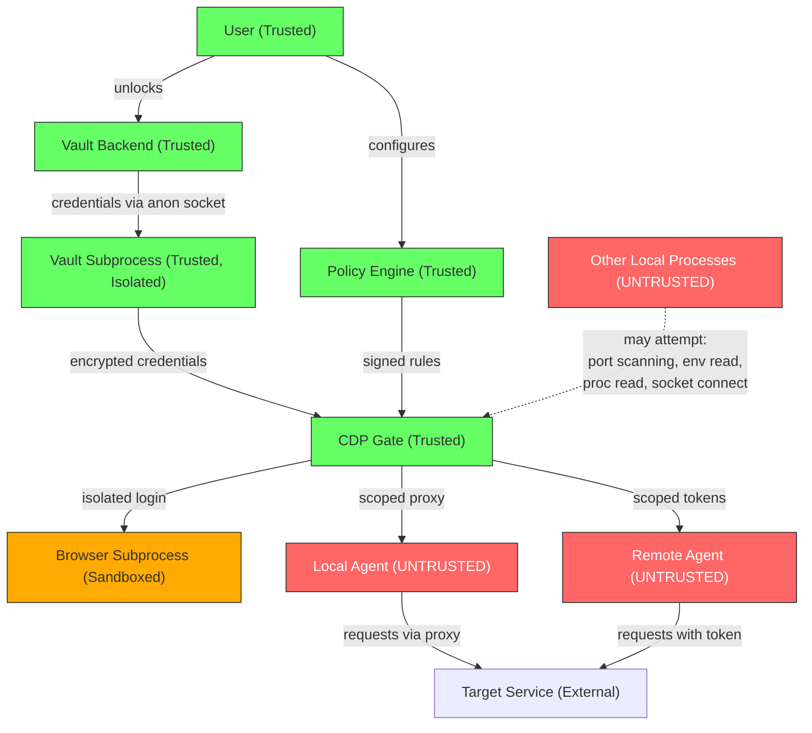

# CDP Threat Model

**Version:** 0.2.0-draft
**Status:** Draft
**Date:** 2026-04-07

## 1. Trust Assumptions

CDP operates under the **compromised agent** threat model: we assume any AI agent may be fully controlled by an adversary via prompt injection, malicious plugins, or supply chain attack. We further assume adversaries may have local process access (same UID) and can read environment variables, enumerate ports, and spawn processes.

### 1.1 Trust Hierarchy



### 1.2 What We Trust

| Component | Trust Level | Justification |
|-----------|------------|---------------|
| User | Full | They own the credentials and define policy |
| CDP Gate daemon | Full | Runs locally, user-controlled, auditable, minimal privilege |
| Vault backend | Full | Established, audited secret managers |
| OS kernel | Full | Standard assumption for local security |
| Policy files | Verified | User-authored, integrity-protected (signing + monitoring) |

### 1.3 What We Do NOT Trust

| Component | Why |
|-----------|-----|
| AI agents (local) | Prompt injection, malicious MCP servers, rogue plugins |
| AI agents (remote) | All local threats + network exposure + unknown runtime |
| Agent memory/context | LLM context windows can be exfiltrated |
| Agent logs/output | May be sent to third-party services |
| Other local processes | Same-UID processes can read /proc, connect to localhost ports, scan env |
| Network (for remote) | Standard network adversary assumptions |
| DNS | DNS can be poisoned or rebound |
| Target service responses | May echo credentials in headers, redirects, or body |

## 2. Attack Vectors & Defenses

This section enumerates known attack vectors against credential delegation systems and how CDP defends against each. This analysis follows the STRIDE methodology and informed the protocol design.

### 2.1 Agent Identity Spoofing

**Attack:** A malicious agent claims to be a trusted agent (e.g., `agent_id = "mcp-github-server"`) to match an auto-approve policy.

**Defense:** Agent identity is cryptographically derived by the Gate, not self-declared. The Gate reads PID via `SO_PEERCRED`, resolves the binary via `/proc/<PID>/exe`, and computes its SHA-256 hash. Auto-approve policies match by binary hash — self-declared names are used only for display and are never sufficient for authorization.

### 2.2 Local Process Proxy Hijacking

**Attack:** Any local process connects to the proxy port and makes authenticated requests using a guessed or observed lease ID.

**Defense:** Every proxy request requires triple authentication:
1. `X-CDP-Lease-Token` — HMAC-SHA256 bearer token bound to the agent's fingerprint
2. `X-CDP-Channel-Binding` — 256-bit nonce linking the control channel to the data channel
3. `SO_PEERCRED` verification — the connecting process must match the lease owner's PID/UID

An attacker must possess both cryptographic secrets AND have the correct process identity.

### 2.3 Browser Session Cookie Exfiltration

**Attack:** Agent receives session cookies (bearer tokens) and exfiltrates them, enabling session hijacking.

**Defense:** CDP defaults to `proxy_only` mode for browser sessions. All browser traffic routes through the CDP MITM proxy, which injects cookies transparently. The agent's browser context contains no cookies — they exist only in the proxy. `Set-Cookie` response headers are stripped before reaching the agent.

For scenarios where proxy mode is impractical, `scoped_snapshot` provides short-TTL, domain-restricted cookies. Full cookie exposure requires explicit policy opt-in and user approval.

### 2.4 Control/Data Channel Separation

**Attack:** Agent A obtains a lease via the JSON-RPC Unix socket. Attacker process B connects to the HTTP proxy and attempts to use A's lease.

**Defense:** Channel binding ties the two channels cryptographically. The Gate generates a random 256-bit nonce at lease creation, delivered over the authenticated JSON-RPC channel. The agent must include this nonce on every proxy request. The proxy also verifies `SO_PEERCRED` — both checks must pass.

### 2.5 Gate Discovery Poisoning

**Attack:** A malicious process sets `CDP_GATE_URL` to point to a rogue Gate that captures credential requests and patterns.

**Defense:** The Gate writes a fingerprint file (`~/.config/cdp/gate.fingerprint`, permissions `0400`) containing its PID, binary hash, and Ed25519 public key. SDKs verify this fingerprint before connecting. For Unix sockets, `SO_PEERCRED` is checked against the fingerprint PID. For HTTPS, the TLS certificate must contain the fingerprint's public key. Stale or missing fingerprints cause connection refusal.

### 2.6 PID Recycling

**Attack:** An agent process dies and its PID is reassigned to an attacker process, which inherits the original agent's registration and active leases.

**Defense:** The Gate uses `pidfd_open()` (Linux 5.3+) to hold a kernel reference to the agent process. When the process exits, the pidfd becomes readable — providing instant notification with zero window for recycling. The agent fingerprint includes the process start time from `/proc/<PID>/stat`, so a recycled PID has a different fingerprint and fails verification.

### 2.7 Policy File Tampering

**Attack:** An agent with filesystem access (many MCP servers have file tools) modifies policy files to add auto-approve rules for itself.

**Defense:** Multi-layered protection:
- Directory permissions `0700`, file permissions `0600`
- `inotify` monitoring detects modifications and logs the modifying process
- Optional Ed25519 policy signing — the Gate rejects unsigned or tampered policies
- Auto-approve policies require `agent_binary_hash` matching — even if a tampered policy uses `agent_id`, the Gate rejects auto-approve without binary hash verification

### 2.8 Headless Browser Exploitation

**Attack:** The Gate runs a headless browser for login flows. A malicious website exploits a browser vulnerability during login, gaining code execution in the Gate process and access to all credentials.

**Defense:** The headless browser runs in a sandboxed subprocess:
- Separate PID namespace, restricted seccomp profile, dropped capabilities
- No access to Gate memory, vault subprocess, or Unix socket
- Communication only via anonymous socket pair
- Subprocess killed immediately after session extraction — never kept alive
- Optional Bubblewrap/Firejail containerization for additional isolation

### 2.9 HTTP Redirect Credential Leakage

**Attack:** Target service returns a redirect to an attacker-controlled host. If the proxy follows the redirect, it sends credentials to the attacker.

**Defense:** The proxy does not follow redirects by default. Redirect `Location` headers are passed to the agent without credential injection. If a policy explicitly enables redirect following, the proxy validates the redirect target against the lease's allowed hosts — redirects to unlisted hosts are blocked and logged.

### 2.10 DNS Rebinding

**Attack:** Allowed hostname initially resolves to the legitimate IP, then DNS changes to an attacker-controlled IP. The proxy sends credentials to the attacker's server.

**Defense:** DNS pinning at lease creation. The Gate resolves all allowed hostnames to IP addresses when the lease is created and pins these IPs for the lease's lifetime. Every proxy request verifies the resolved IP matches the pinned IP. Mismatches are blocked and logged.

### 2.11 Request Body Scope Escalation

**Attack:** An agent with `POST /repos/owner/repo` scope crafts a request body that creates a deploy key or grants admin access. Host/path/method checks pass — the body is the attack vector.

**Defense:** Policies support body-level constraints:
- `forbidden_fields` — JSON keys that cause rejection
- `forbidden_paths` — explicit deny-list overriding allow patterns
- `allowed_content_types` — restrict Content-Type
- `max_size_bytes` — prevent large uploads

Users should scope paths narrowly in addition to using body constraints.

### 2.12 Credential Reference Enumeration

**Attack:** A registered agent calls `cdp.credentials.list` and learns names of all credentials in the vault, useful for reconnaissance even without access.

**Defense:** `cdp.credentials.list` returns only references matching the agent's policy-allowed credentials. Agents with no matching policy receive an empty list. The endpoint is rate-limited to 1 call per 60 seconds.

### 2.13 Approval UI Social Engineering

**Attack:** A prompt-injected agent sends a convincing reason like "CRITICAL SECURITY PATCH — approve immediately" to trick the user into approving.

**Defense:** The approval dialog:
- Labels the reason as "agent-provided (unverified)" with visual separation
- Shows the binary path and hash (not self-declared name)
- Flags first-time agents prominently
- Defaults to "Allow Once" (not open-ended allow)
- Truncates reason to 200 characters (prevents UI overflow)
- Cannot be dismissed programmatically by the agent

### 2.14 Infinite Lease Renewal

**Attack:** An agent repeatedly renews a lease, maintaining credential access indefinitely without re-approval.

**Defense:** Hard renewal limits enforced by the Gate:
- `max_renewals` per lease (default: 3)
- `max_cumulative_ttl` including all renewals (default: 4 hours)
- Each renewal re-checks agent liveness and fingerprint
- Policy can disable renewals entirely with `renewable = false`

### 2.15 Session Key Single Point of Failure

**Attack:** If the encryption session key is extracted (side-channel, memory corruption), all credentials in memory are exposed simultaneously.

**Defense:** Per-credential key isolation via HKDF:
```
credential_key = HKDF-SHA256(master_session_key, credential_ref || lease_id)
```
Each credential is encrypted with a unique derived key. Compromising one key exposes one credential, not all.

### 2.16 /proc/PID/environ Credential Leakage

**Attack:** CLI wrapper sets credential environment variables in a child process. Same-UID processes read `/proc/<PID>/environ`.

**Defense:** Credentials are never pre-loaded into environment variables. The `GIT_ASKPASS` pattern uses a helper binary that fetches credentials on demand via anonymous pipe from the Gate. Child processes run with `PR_SET_DUMPABLE=0` (prevents `/proc/PID/environ` reads). The helper zeroes memory and exits immediately after delivery.

### 2.17 JSON-RPC Replay

**Attack:** Attacker captures a JSON-RPC message and replays it to re-register or re-request leases.

**Defense:** Every request includes a UUID v4 nonce and timestamp. The Gate rejects timestamps older than 30 seconds and duplicate nonces within a 5-minute sliding window. Session tokens are bound to the Unix socket connection.

### 2.18 Audit Log Tampering

**Attack:** A compromised process modifies or deletes audit logs to cover tracks.

**Defense:** Audit logs use a hash chain — each entry includes the hash of the previous entry. Tampering is detectable on Gate startup or at any time by verifying the chain. Optional real-time streaming to remote syslog/SIEM. Log files are owned by the Gate's dedicated user with `0600` permissions.

### 2.19 MITM Proxy CA Key Compromise

**Attack:** Attacker extracts the MITM proxy CA key and can man-in-the-middle any HTTPS connection.

**Defense:** The CA key is encrypted at rest, decrypted only in the MITM proxy subprocess. CA certificates have 24-hour validity with daily rotation. CAs are name-constrained to origins in active leases only. The CA is added to the browser context only — never the system trust store.

### 2.20 WebSocket Post-Upgrade Abuse

**Attack:** After WebSocket upgrade (which includes credential injection), the agent has an authenticated bidirectional channel that the proxy cannot inspect at the message level.

**Defense:** The proxy enforces lease constraints on WebSocket connections:
- `max_requests` counts WebSocket messages
- Lease TTL kills the connection when expired
- Revocation immediately terminates the WebSocket

WebSocket message content inspection is out of scope. Policies should use shorter TTLs and conservative rate limits for WebSocket-enabled leases.

### 2.21 Vault Session Token Exposure

**Attack:** Vault CLI session tokens (e.g., Bitwarden `BW_SESSION`) leak via environment variables, crash dumps, or logging, exposing all vault contents.

**Defense:** Vault backends run in dedicated subprocesses with separate PID namespaces and restricted seccomp profiles. Session tokens exist only in subprocess memory. Communication with the Gate uses anonymous Unix socket pairs — never environment variables or files. The subprocess sets `PR_SET_DUMPABLE=0`.

## 3. Attack Surface Matrix

```mermaid
graph TD
    subgraph "Attack Vectors"
        A1["Agent ID Spoofing"]
        A2["Proxy Hijacking"]
        A3["Cookie Exfiltration"]
        A4["Channel Separation"]
        A5["Gate Discovery Poisoning"]
        A6["PID Recycling"]
        A7["Policy Tampering"]
        A8["Browser Exploitation"]
        A9["Redirect Leakage"]
        A10["DNS Rebinding"]
        A11["Body Escalation"]
        A12["Credential Enumeration"]
        A13["Social Engineering"]
        A14["Infinite Renewal"]
        A15["Session Key SPOF"]
    end

    subgraph "Defenses"
        D1["Binary Hash Fingerprint"]
        D2["Triple-Layer Proxy Auth"]
        D3["Proxy-Only Browser Mode"]
        D4["Channel Binding Nonce"]
        D5["Gate Fingerprint Verification"]
        D6["pidfd + Process Start Time"]
        D7["Policy Signing + Monitoring"]
        D8["Sandboxed Browser Subprocess"]
        D9["Redirect Blocking"]
        D10["DNS Pinning"]
        D11["Body Constraint Validation"]
        D12["Policy-Scoped Credential List"]
        D13["Untrusted Reason Labeling"]
        D14["Hard Renewal Limits"]
        D15["Per-Credential Key Derivation"]
    end

    A1 --> D1
    A2 --> D2
    A3 --> D3
    A4 --> D4
    A5 --> D5
    A6 --> D6
    A7 --> D7
    A8 --> D8
    A9 --> D9
    A10 --> D10
    A11 --> D11
    A12 --> D12
    A13 --> D13
    A14 --> D14
    A15 --> D15

    style A1 fill:#f66,stroke:#333,color:#fff
    style A2 fill:#f66,stroke:#333,color:#fff
    style A3 fill:#f66,stroke:#333,color:#fff
    style A4 fill:#f66,stroke:#333,color:#fff
    style A5 fill:#f66,stroke:#333,color:#fff
    style A6 fill:#f96,stroke:#333,color:#fff
    style A7 fill:#f96,stroke:#333,color:#fff
    style A8 fill:#f96,stroke:#333,color:#fff
    style A9 fill:#f96,stroke:#333,color:#fff
    style A10 fill:#f96,stroke:#333,color:#fff
    style A11 fill:#f96,stroke:#333,color:#fff
    style A12 fill:#f96,stroke:#333,color:#fff
    style A13 fill:#f96,stroke:#333,color:#fff
    style A14 fill:#f96,stroke:#333,color:#fff
    style A15 fill:#f96,stroke:#333,color:#fff
    style D1 fill:#6f6,stroke:#333
    style D2 fill:#6f6,stroke:#333
    style D3 fill:#6f6,stroke:#333
    style D4 fill:#6f6,stroke:#333
    style D5 fill:#6f6,stroke:#333
    style D6 fill:#6f6,stroke:#333
    style D7 fill:#6f6,stroke:#333
    style D8 fill:#6f6,stroke:#333
    style D9 fill:#6f6,stroke:#333
    style D10 fill:#6f6,stroke:#333
    style D11 fill:#6f6,stroke:#333
    style D12 fill:#6f6,stroke:#333
    style D13 fill:#6f6,stroke:#333
    style D14 fill:#6f6,stroke:#333
    style D15 fill:#6f6,stroke:#333
```



## 4. Accepted Residual Risks

These risks are acknowledged, with mitigations noted:

| Risk | Why Accepted | Mitigation |
|------|-------------|------------|
| Gate daemon compromise (code execution) | Gate is the trust anchor — if compromised, game over | Minimal privileges, seccomp, encrypted memory, future TEE support |
| Vault backend compromise | Out of CDP scope — vault's own security model | Use well-audited vaults; CDP adds defense-in-depth with per-credential keys |
| User approves malicious request | User is the ultimate authority | Improved approval UI with untrusted-reason labeling and binary identification |
| Supply chain attack on agent binary | Binary hash matches the compromised binary | Future: signed binary verification, reproducible builds |
| Page content leaking session data in proxy_only mode | Cannot filter JavaScript/HTML content reliably | Short session TTLs, scope to specific origins |
| WebSocket open channel within TTL | Cannot inspect WebSocket message semantics | Short TTLs, conservative rate limits |
| Speculative execution side channels | Hardware-level; defense is expensive | Per-credential keys limit blast radius; future TEE support |

## 5. Security Implementation Requirements

### 5.1 Gate Daemon

- MUST run as a dedicated user with minimal privileges
- MUST use `mlock()` for all credential memory
- MUST disable core dumps (`PR_SET_DUMPABLE=0`, `RLIMIT_CORE=0`)
- MUST use seccomp or equivalent syscall filtering
- MUST use per-credential key derivation (HKDF)
- SHOULD run in a dedicated namespace/container
- MUST log all credential access events with tamper-evident hash chain
- MUST zero credential memory immediately after use
- MUST verify agent fingerprint on every operation
- MUST monitor agent process liveness via pidfd

### 5.2 Proxy Component

- MUST authenticate every request (lease_token + channel_binding + SO_PEERCRED)
- MUST validate every request against lease constraints (host, path, method, body)
- MUST NOT follow redirects by default
- MUST pin DNS at lease creation
- MUST strip credential-echoing response headers
- MUST terminate TLS independently (no TLS passthrough)
- MUST enforce rate limits per lease
- MUST reject requests after lease expiry
- MUST kill WebSocket connections on lease expiry/revocation

### 5.3 CLI Wrapper

- MUST NOT pass credentials via command-line arguments
- MUST NOT pre-load credentials into environment variables
- MUST use on-demand credential fetch (ASKPASS/pipe pattern)
- MUST set `PR_SET_DUMPABLE=0` on child processes
- MUST clean up any temporary credential artifacts immediately
- MUST filter credentials from stdout/stderr before returning to agent

### 5.4 Browser Session Manager

- MUST run headless browser in sandboxed subprocess (PID namespace, seccomp, dropped caps)
- MUST use `proxy_only` mode by default (agent never sees cookies)
- MUST NOT expose login page DOM to the agent
- MUST validate that session artifacts don't contain raw credentials
- MUST use name-constrained, short-lived CA certificates for MITM proxy
- MUST add CA to browser context only, never system trust store

### 5.5 Policy Engine

- MUST require `agent_binary_hash` for auto-approve policies
- MUST reject auto-approve policies matching by `agent_id` alone
- MUST watch policy directory for unauthorized modifications
- MUST support optional policy signing
- MUST scope `cdp.credentials.list` to policy-allowed references only

### 5.6 Vault Integration

- MUST run vault backend in isolated subprocess
- MUST communicate via anonymous Unix socket pair (not env vars)
- MUST hold vault session tokens only in subprocess memory
- MUST re-authenticate on subprocess crash
