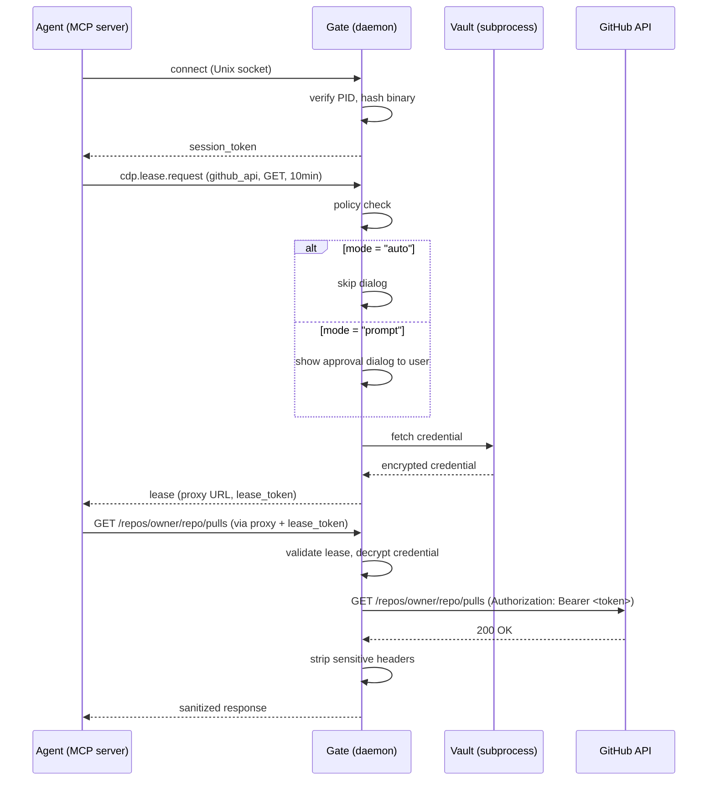
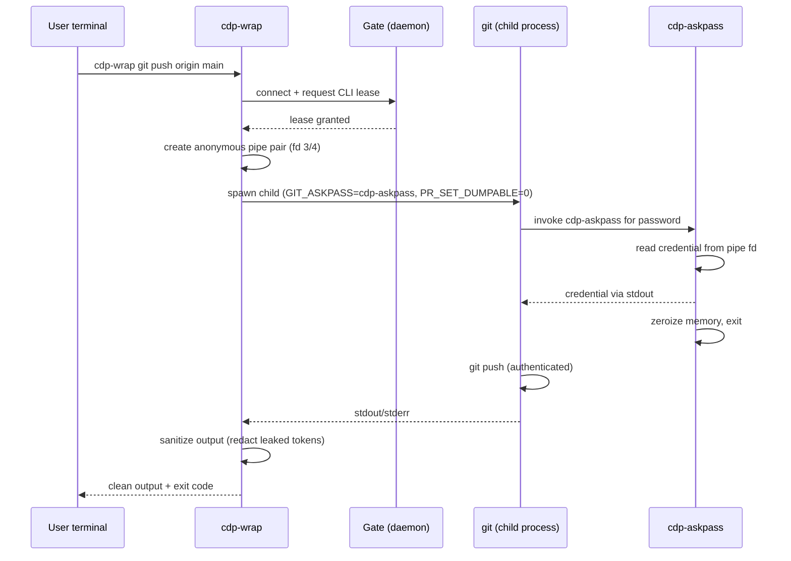
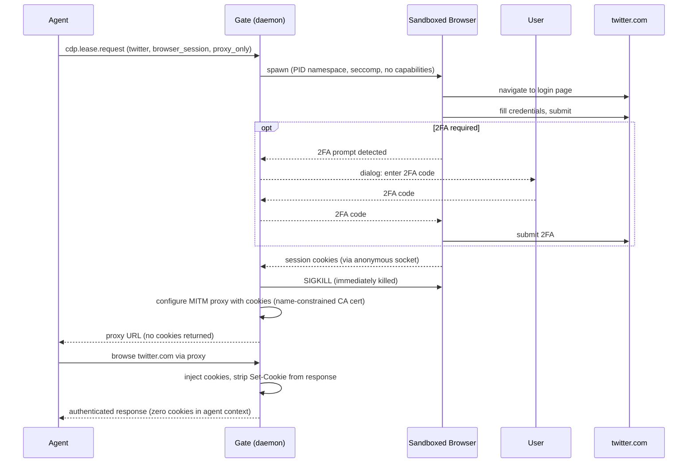

# CDP User Journey

**Version:** 0.2.0-draft
**Purpose:** End-to-end walkthrough of what users and agents experience when using CDP.

---

## 1. First-Time Setup

### What the user does

```
# Install CDP Gate (single binary)
cargo install cdp-gate

# Start the daemon
cdp-gate start
```

On first launch, the Gate:
- Creates `~/.config/cdp/` (config) and `~/.local/share/cdp/` (data)
- Generates a keypair and writes `~/.config/cdp/gate.fingerprint`
- Opens a Unix socket at `/run/cdp/gate.sock`
- Starts the audit log at `~/.local/share/cdp/audit.jsonl`

### What the user configures

**`~/.config/cdp/gate.toml`** — vault backend and global settings:

```toml
[vault]
backend = "bitwarden"          # or "file", "1password", "system-keyring"

[audit]
path = "~/.local/share/cdp/audit.jsonl"
```

**`~/.config/cdp/policies/github.toml`** — per-credential access rules:

```toml
[[policy]]
name = "github-readonly"

[policy.match]
agent_binary_hash = "sha256:a1b2c3..."   # hash of the MCP server binary
credential_ref = "github_api"             # name in your vault

[policy.allow]
hosts = ["api.github.com"]
methods = ["GET"]
paths = ["/repos/**"]

[policy.approval]
mode = "auto"       # no dialog needed — binary hash is trusted
```

That's it. Credentials stay in Bitwarden (or whichever vault). CDP never copies them out permanently.

---

## 2. An Agent Uses an API Credential

This is the most common flow. An MCP server or AI tool needs to call GitHub, Slack, etc.

### What happens (step by step)



### What the agent sees

```json
// 1. Register
{"method": "cdp.register"} → session_token

// 2. Request lease
{"method": "cdp.lease.request", "params": {
  "credential_ref": "github_api",
  "scope": {"hosts": ["api.github.com"], "methods": ["GET"], "ttl_seconds": 600}
}}
→ {"proxy": {"url": "http://127.0.0.1:19042", "lease_token": "cdp_lt_..."}}

// 3. Make requests through the proxy — credential injected automatically
GET http://127.0.0.1:19042/repos/owner/repo/pulls
X-CDP-Lease-Token: cdp_lt_...

→ 200 OK (authenticated response, no token visible)
```

### What the user sees

- **If `mode = "auto"`:** Nothing. Policy matched, binary hash verified, lease granted silently.
- **If `mode = "prompt"`:** An approval dialog:

```
┌─────────────────────────────────────────────────────┐
│  CDP: Credential Access Request                     │
│                                                     │
│  Agent:       /usr/bin/node (.../mcp-github-server) │
│  Binary hash: sha256:a1b2c3...                      │
│  Credential:  github_api                            │
│  Access:      GET api.github.com/repos/**           │
│  Duration:    10 minutes, max 10 requests           │
│  Reason:      "Fetching PRs for review" [UNVERIFIED]│
│                                                     │
│  [ Allow Once ]  [ Allow 10 min ]  [ Deny ]         │
└─────────────────────────────────────────────────────┘
```

The "reason" is agent-supplied and labeled UNVERIFIED. Default action is "Allow Once."

---

## 3. An Agent Uses a CLI Tool (git, ssh, kubectl)

This is Phase 7. Instead of HTTP proxy injection, credentials are delivered through pipes.

### What the user does

```bash
# Instead of letting the agent run `git push` directly:
cdp-wrap git push origin main

# Or for SSH:
cdp-wrap ssh user@host "deploy.sh"

# Or for kubectl:
cdp-wrap kubectl apply -f deployment.yaml
```

### What happens under the hood



### What the user sees

```bash
$ cdp-wrap git push origin main
Enumerating objects: 5, done.
Counting objects: 100% (5/5), done.
Writing objects: 100% (3/3), 312 bytes | 312.00 KiB/s, done.
Total 3 (delta 2), reused 0 (delta 0)
To github.com:owner/repo.git
   abc1234..def5678  main -> main
```

Normal git output. No credentials visible. If git accidentally echoes a token in stderr, it shows as `[CDP:REDACTED]`.

### Key properties

- Credential never stored in environment variables (only the ASKPASS helper path is)
- Credential never visible in `ps aux` or `/proc/PID/environ`
- Pipe is anonymous (no filesystem path to intercept)
- Helper process is ephemeral (runs for microseconds, then exits)

---

## 4. An Agent Uses a Browser Session

For browser automation (Playwright, browserUse, etc.).

### Default mode: `proxy_only` (zero-knowledge)



### What the user sees

- If 2FA is needed: a dialog asking for the code (one time per session)
- Otherwise: nothing visible

### The three modes

| Mode | Agent sees cookies? | Use case |
|------|-------------------|----------|
| `proxy_only` (default) | No | Agent browses authenticated, zero cookie exposure |
| `scoped_snapshot` | Limited | Short-TTL, domain-restricted cookies when proxy impractical |
| `full_snapshot` | Yes | Requires explicit policy + approval. Dangerous. |

---

## 5. Lease Lifecycle

Every credential lease has hard limits. No exceptions.

### Boundaries

| Limit | Default | Max |
|-------|---------|-----|
| TTL per lease | 10 min | policy-defined |
| Requests per lease | 10 | policy-defined |
| Renewals per lease | 3 | 3 (protocol max) |
| Cumulative TTL | — | 4 hours |

### Renewal

```json
{"method": "cdp.lease.renew", "params": {
  "lease_id": "lease_a1b2c3d4",
  "extend_seconds": 300
}}
```

Gate checks: agent still alive, renewals remaining > 0, cumulative TTL within bounds.

### Revocation triggers

- **TTL expires** — automatic
- **Request count exhausted** — automatic
- **Agent process dies** — Gate detects via pidfd, revokes immediately (no polling)
- **User revokes manually** — via CLI or GUI
- **Parent lease revoked** — cascades to all delegated child leases

### On revocation

1. Proxy stops accepting requests for this lease
2. Credential plaintext zeroized from memory
3. Per-credential encryption key zeroized
4. Audit log entry written

---

## 6. Multi-Agent Delegation

An orchestrator agent can delegate a subset of its access to sub-agents.

```
User grants Agent A: GitHub read+write, api.github.com

Agent A delegates to Agent B:
  → GitHub read-only (GET only), api.github.com, 30 min
  → Scope must be strict subset of parent
  → Depth limited to 3 levels

If Agent A's lease is revoked → Agent B's lease revoked immediately
```

User sees a delegation approval dialog if the policy requires it.

---

## 7. What Gets Logged

All actions produce tamper-evident audit entries (hash-chained):

```
14:05:00  lease.granted   github_api → mcp-github-server  auto-approved  [10min, 10req]
14:05:15  lease.used      GET /repos/owner/repo/pulls      (9 remaining)
14:05:18  lease.used      GET /repos/owner/repo/issues      (8 remaining)
14:15:00  lease.expired   ttl_elapsed
```

Each entry includes a hash of the previous entry. Tampering breaks the chain — Gate verifies integrity on startup.

---

## 8. Experience Summary

### For the user (credential owner)

| Step | Effort | Frequency |
|------|--------|-----------|
| Install Gate | One command | Once |
| Configure vault backend | Edit one TOML file | Once |
| Write policy for an agent | ~10 lines of TOML per agent | Per agent |
| Approve access (if `prompt` mode) | Click "Allow Once" | Per lease request |
| Approve access (if `auto` mode) | Nothing | Never |
| Monitor usage | Read audit log | As needed |

### For the agent developer

| Step | Effort |
|------|--------|
| Discover Gate | Read fingerprint file |
| Register | One JSON-RPC call |
| Request lease | One JSON-RPC call |
| Use credential | Route HTTP through proxy (set `HTTP_PROXY`) |
| Handle expiry | Catch `-32005` error, request new lease |

### For CLI tool usage

| Step | Effort |
|------|--------|
| Use wrapped tool | Prefix command with `cdp-wrap` |

---

## 9. Comparison: With vs Without CDP

### Without CDP (typical today)

```bash
# Credential in environment — visible to every process
export GITHUB_TOKEN=ghp_xxxxxxxxxxxx

# Agent runs with full token access
mcp-server --github-token=$GITHUB_TOKEN
# → token in /proc/PID/environ
# → token in shell history
# → no scope limits
# → no expiry
# → no audit trail
# → if agent is compromised, attacker has full token
```

### With CDP

```bash
# No token in environment
cdp-gate start

# Agent connects to Gate, gets scoped proxy access
# → token never in memory of agent process
# → scoped to specific endpoints, methods, time
# → hard expiry (max 4 hours cumulative)
# → full audit trail
# → if agent is compromised, attacker gets nothing usable
```
